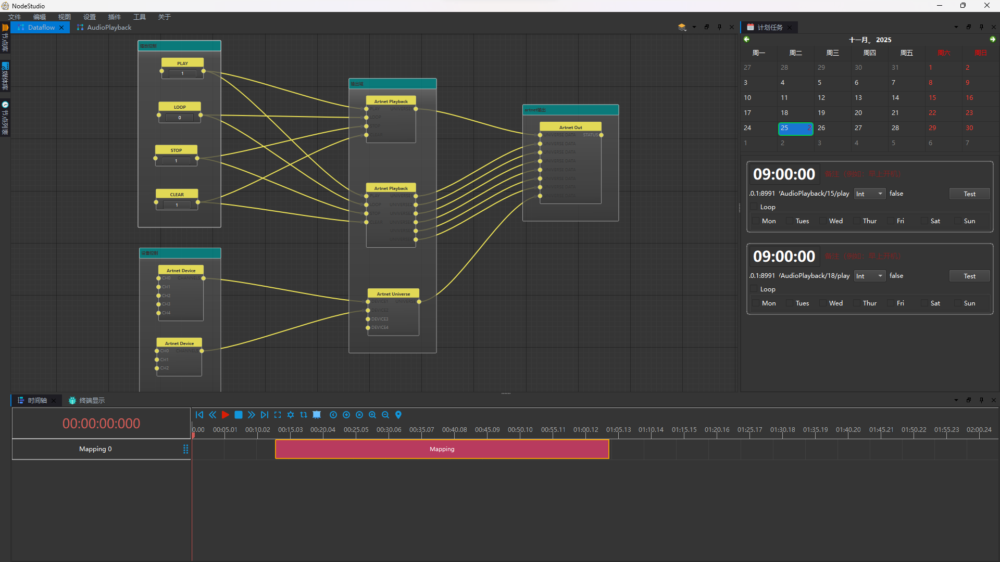
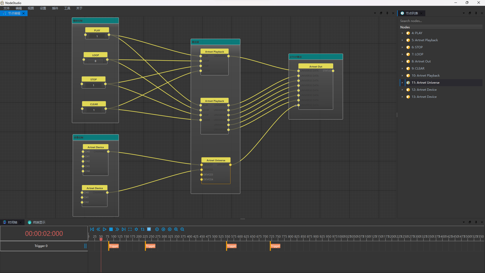
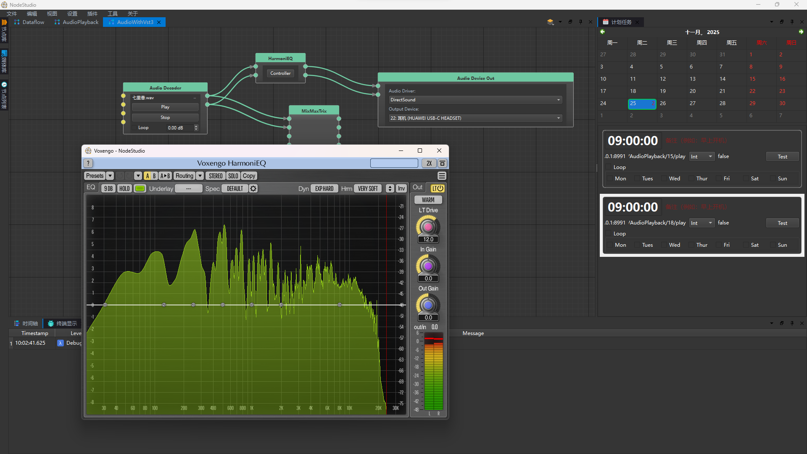
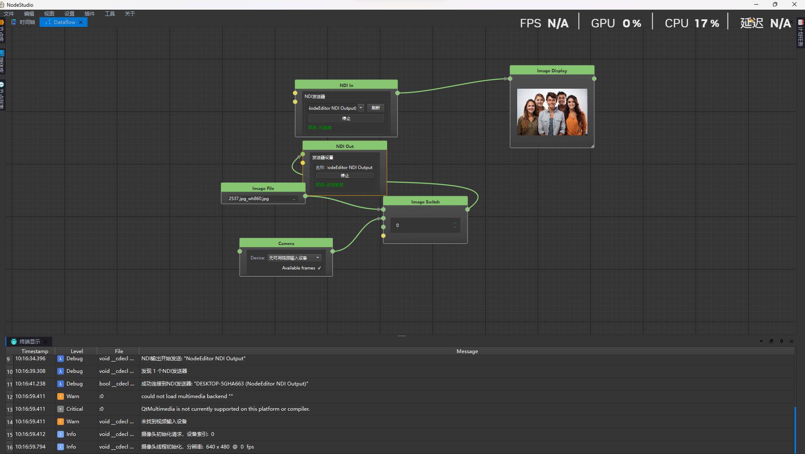
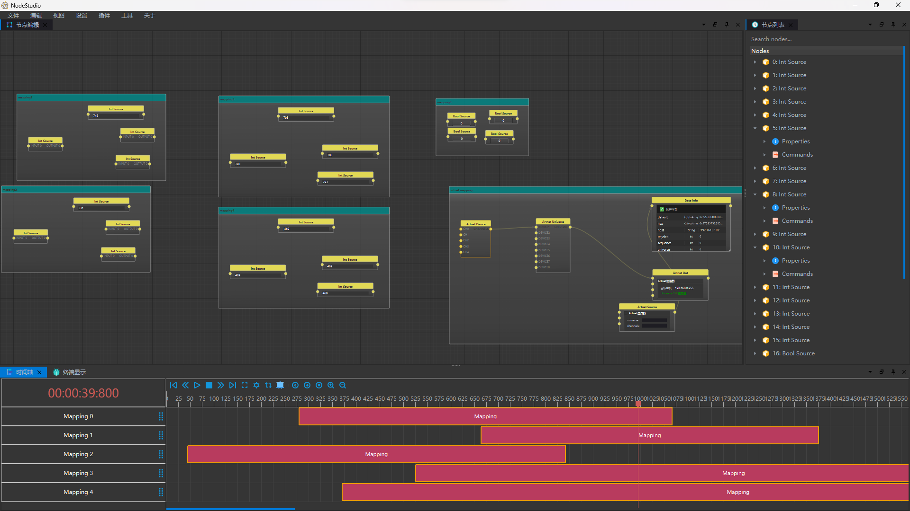
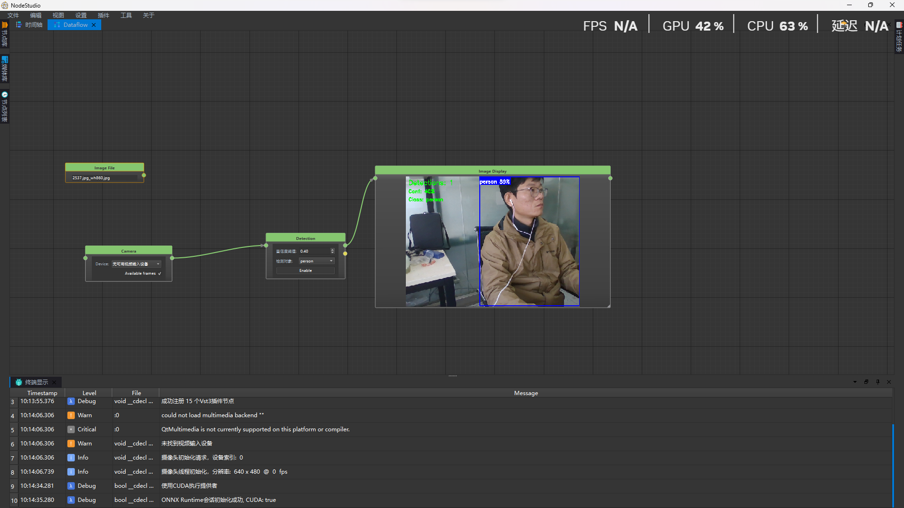

## 节点编辑器
### 已实现：
- OSC in and out 
- Artnet in and out
- Artnet record and playback
- Hotkey
- Camera in
- Audio decoder
- Audio device out
- Audio device in
- VST3 audio process
- Tcp in and out
- Udp in and out
- Lua script support
- Timeline Dataflow mutual control
- Javascript support
- External OSC control base global OSC tree
- Websocket in and out
- LTC Decoder
- NDI in and out
- Support scheduled events
- Onnx model inference
- Implement the web interface based on OSC
- Node is plugin-based and supports custom development
- Provide C++ SDK and support the development of custom nodes
## 时间轴
### 已实现：
- External OSC control base global OSC tree
- Control the NodePlayer by websocket
- Provide the clock synchronization signal to the NodePlayer
- clip is plugin-based and supports custom development
- Timeline stage
- Timeline model
- Timeline view
- Timeline screen
- Timeline track
- Timeline clip
- Timeline event
- Support scheduled events
- Provide C++ SDK and support the development of custom clip
## 下一步计划
- 优化性能，提高稳定性
- 增加更多的节点类型
    - 增加更多的音频节点类型，完善音频数据流功能
    - 增加更多的视频节点类型，完善视频数据流功能
    - 增加更多的控制节点类型，完善控制功能
- 增加更多的时间轴功能
- 完善Dashboard功能，提高集成度
- 优化交互逻辑，提高使用体验

## Screenshots
### Artnet controls：

### ArtnetPlayback：

### Audio play：

### Audio play with vst3：

### NDI in and out：

### Artnet to Reaper：

### Timeline data mappings：

### Yolo inference：
