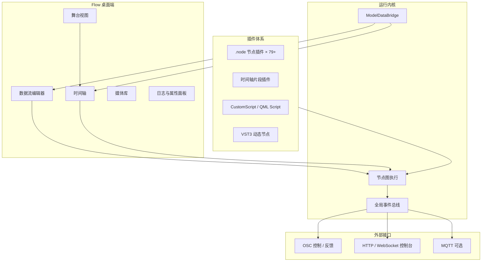
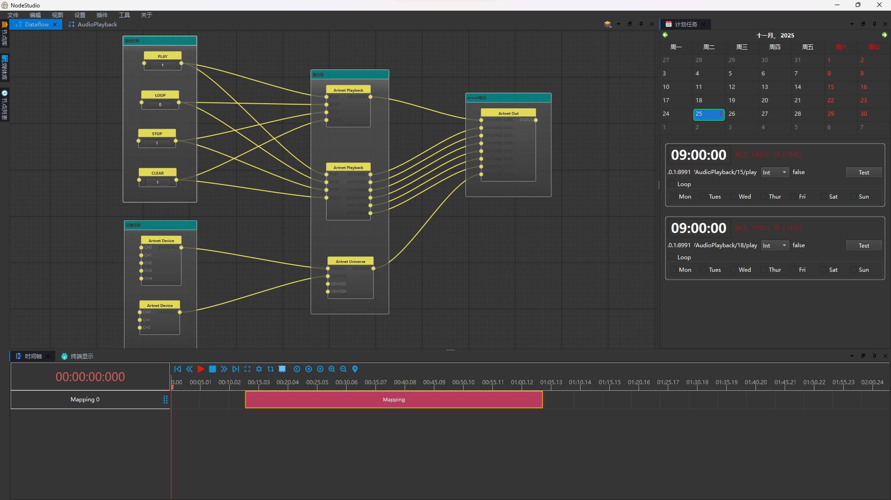
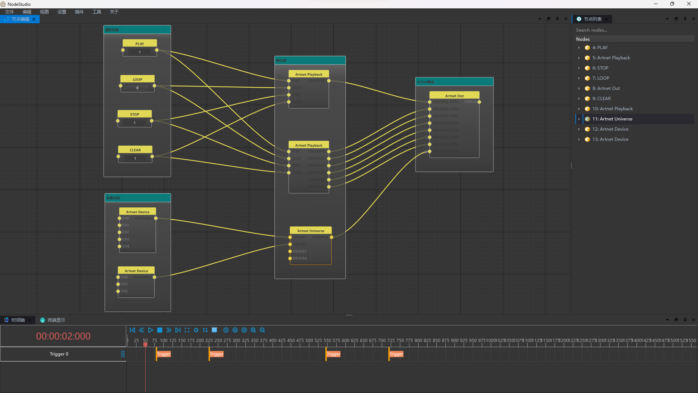
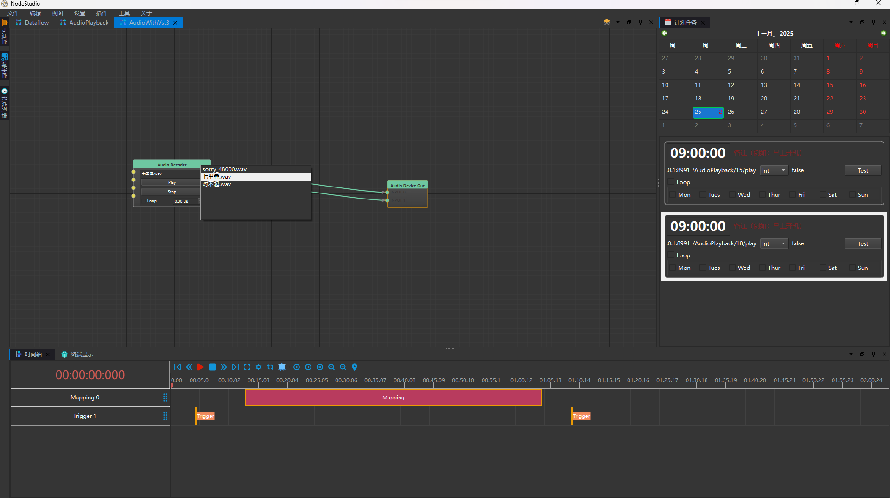
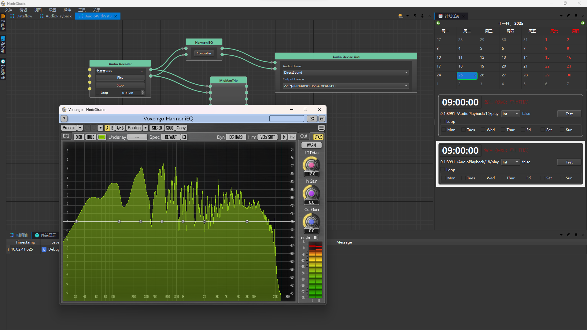
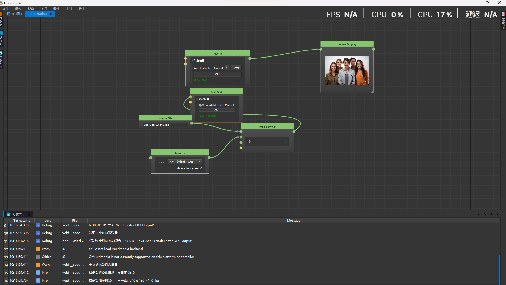
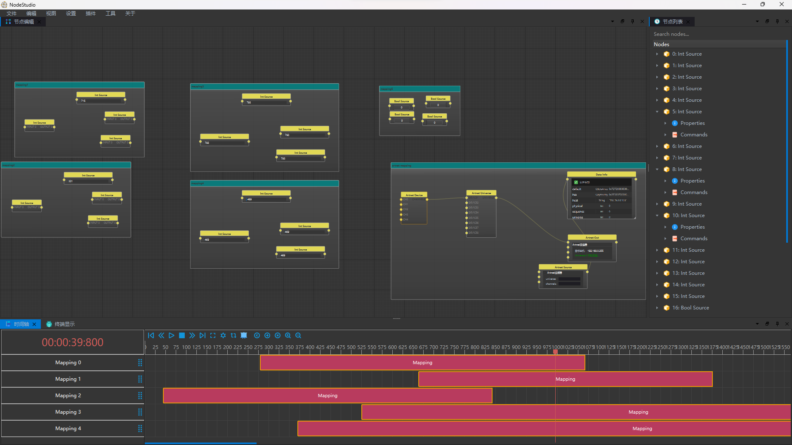
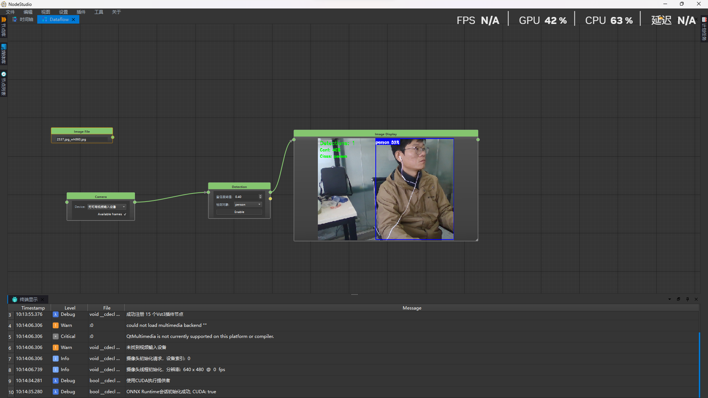

# Flow

**Flow** 是一款面向演出、展陈与现场控制的**可视化节点编排软件**。它将**数据流编辑器**、**时间轴**与**外部协议控制**整合在同一套工程中，让你用「连线」的方式搭建灯光、音视频、设备通信与自动化逻辑，而无需编写大量底层代码。

同时提供无界面版本 **FlowRuntime**，适合部署在控台、服务器或长期运行的现场环境。

---

## 软件能做什么

| 场景 | 典型用法 |
|------|----------|
| 灯光控制 | Art-Net / DMX 收发、Universe 回放、与 Reaper 等软件联动 |
| 音视频 | 摄像头 / NDI / Spout 采集、解码播放、VST3 效果链、LTC 时间码 |
| 设备通信 | 串口、TCP/UDP、WebSocket、OSC、MQTT、Modbus PLC |
| 现场自动化 | 热键触发、条件分支、延迟队列、值查表、脚本扩展 |
| AI 视觉 | YOLO 目标/姿态/人脸检测（ONNX 推理） |
| 远程控制 | 内置 HTTP 网页控制台、全局 OSC 地址树、计划任务 |

---

## 核心架构


```mermaid
flowchart TB
    subgraph UI["Flow 桌面端"]
        DF[数据流编辑器]
        TL[时间轴]
        ST[舞台视图]
        ML[媒体库]
        LG[日志与属性面板]
    end

    subgraph Runtime["运行内核"]
        NP[节点图执行]
        EV[全局事件总线]
        BR[ModelDataBridge]
    end

    subgraph External["外部接口"]
        OSC[OSC 控制 / 反馈]
        HTTP[HTTP / WebSocket 控制台]
        MQTT[MQTT 可选]
    end

    subgraph Plugins["插件体系"]
        Nodes[".node 节点插件 × 79+"]
        Clips["时间轴片段插件"]
        JS["CustomScript / QML Script"]
        VST["VST3 动态节点"]
    end

    DF --> NP
    TL --> NP
    ST --> TL
    NP --> EV
    EV --> OSC
    EV --> HTTP
    EV --> MQTT
    Plugins --> NP
    BR --> DF
    BR --> TL
```

**一条工程（`.flow`）通常包含：**

- 一个或多个**数据流**（DataFlow）：节点图 + 连线 + 参数
- **时间轴**（Timeline）：按时间编排的片段（Clip）
- **舞台**（Stage）：与时间轴关联的可视化布局
- **媒体库**、**计划任务**、**外部控制**配置

数据流之间可通过 **ModelDataBridge** 与时间轴、子流程（`.childflow`）互相驱动，实现「时间轴控节点、节点控时间轴」的双向联动。

---

## 主要功能模块

### 1. 数据流编辑器（Node Editor）

基于 [QtNodes](https://github.com/bwll1989/nodeeditor) 的可视化节点图：

- 拖拽节点、连接端口、分组、撤销/重做
- 支持多个数据流标签页，每个数据流独立运行
- 节点内嵌参数面板，部分节点支持端口数量编辑
- 内置 Source / Variable / In / Out 等基础节点（BuildInNodes）
- **79+ 官方节点插件**，按类别组织在节点库中

每个节点插件目录下均有面向用户的 **`Doc.md`** 文档（节点说明、端口、界面、用法、示例），便于查阅。

### 2. 时间轴（Timeline）

基于 [QtTimeLine](https://github.com/bwll1989/QtTimeLine.git) 的非线性时间编排：

- 多轨道、多片段、缩放与播放控制
- 支持 **LTC / MTC / 音频 / 视频** 等同步方式
- 与时间轴节点（TimeLineNode）及全局 OSC 总线联动
- 可通过 WebSocket 远程控制 NodePlayer

**片段（Clip）插件：**

| 片段 | 说明 |
|------|------|
| VideoClip | 视频片段播放 |
| ImageClip | 图片序列 / 静态图 |
| ArtnetClip | Art-Net 数据发送 |
| MappingClip | 数据映射片段 |
| TriggerClip | 触发类事件 |

片段与时间轴模型、舞台视图共享同一套数据，并支持插件化扩展（参考 `src/Clips/`）。

### 3. 外部控制与网页控制台

Flow 内置 **GlobalEventBus（全局事件总线）**，将节点参数映射为统一的 OSC 风格地址树，便于外部系统读写。

**典型地址格式：**

```
/dataflow/{数据流别名}/{节点ID}/{参数路径}
/timeline/{...}
```

**控制方式：**

| 方式 | 说明 |
|------|------|
| OSC | 默认控制端口 `8991`，反馈端口 `8990`（可在系统设置中修改） |
| HTTP / WebSocket | 内置 Web 控制台（默认 `http://127.0.0.1:8992`），菜单 **工具 → 打开网页控制台** |
| MQTT | 可选启用，订阅控制主题、发布反馈主题 |
| 计划任务 | 日历式定时触发，与时间轴/数据流配合 |

网页控制台支持项目上传下载、媒体上传、布局保存等 API，适合平板或远程运维。

### 4. 插件化扩展

| 类型 | 输出 | 说明 |
|------|------|------|
| C++ 节点插件 | `bin/plugins/DataFlow/*.node` | 参考 `src/Nodes/<NodeName>/` 模板开发 |
| JS 自定义节点 | 运行时扫描 JS 目录 | CustomScriptNode，元数据定义端口与 UI |
| QML Script 节点 | 同上 | 支持 `setUiSchema` 声明式面板 |
| VST3 插件 | 每个 `.vst3` 注册为独立节点 | 放入 `<程序目录>/plugins/VST3` |
| 时间轴片段 | Clip 插件 | 参考 `src/Clips/` 各子目录 |

菜单 **插件 → 插件管理器** 可加载/卸载节点；**插件 → 打开插件文件夹** 快速定位插件目录。

---

## 节点库概览

官方内置节点按 **PLUGIN_TAG** 分为以下类别（部分代表节点）：

### Controls — 控制与逻辑

Delay、Switch、Merge、Condition、Count、Hold、Inject、Value Lookup、HotKey、Extract、LFO、Curve、Math/Logic 运算、TimeLineNode、Data Info、Data Visual、JavaScript / QML Script、Internal Commands 等。

### Connect — 网络与协议

Serial Port、TCP Server/Client、UDP Socket、WebSocket Server/Client、OSC Source/Output、Mqtt Client。

### Image — 图像与视频

Camera、Capture、Scale/Cut/Compare/Threshold/Switch、NDI In/Out、Spout In/Out、Color、Video Decoder、Image Constant / Layout 等。

### Audio — 音频

Audio Device In/Out、Audio Decoder、Noise Generator、Audio Matrix、Ducking / CrossFader / Priority、LTC Decoder/Generator、Fmod、VST3（动态）、Audio Analysis。

### DMX — 灯光

Artnet Source/Out、DMX Device、DMX Universe、Universe Playback。

### Devices — 现场设备

Mpv Controller、PJLink、NDV Server/Player、PLC ModBus、DAW Controller、TSETL、showStoreGBx、USR-IO808 等。

### ONNX — AI 推理

Object Detection、Pose Detection、Face Detection、StyleTransfer（YOLO v11n）。

> 完整列表见 `src/Nodes/CMakeLists.txt` 中的 `ALL_NODES`；各节点详细说明见对应目录下的 `Doc.md`。

---

## 两个可执行程序

| 程序 | 用途 |
|------|------|
| **Flow** | 完整 GUI：编辑、调试、预览、媒体管理 |
| **FlowRuntime** | 无界面后台运行：加载同一套 `.flow` 工程，适合控台服务器长期运行 |

两者互斥单实例（不可同时运行）。FlowRuntime 仍保留 HTTP 服务、系统托盘、插件加载与数据流执行能力。

---

## 快速开始

### 运行

1. 启动 **Flow.exe**
2. **文件 → 打开文件**，选择 `.flow` 工程；或命令行传入路径：`Flow.exe "path/to/project.flow"`
3. 从底部**节点库**拖拽节点到画布，连接端口
4. 需要远程控制时，打开 **工具 → 打开网页控制台**

### 工程与数据目录

| 类型 | 默认位置（Windows） |
|------|---------------------|
| 工程文件 `.flow` | 用户自选路径 |
| 媒体库 | `文档/Flow/Medias` |
| 日志 | `文档/Flow/Logs` |
| 最近文件配置 | `文档/Flow/Cfg` |

子数据流保存为 **`.childflow`**，可被主工程引用，适合模块化复用（如「音频子系统」「灯光子系统」）。

### 示例工程

`example/` 目录提供可直接打开的流程示例：

| 目录 | 说明 |
|------|------|
| `Artnet controls` / `ArtnetPlayback` | Art-Net 控制与回放 |
| `Artnet to Reaper` | Art-Net 驱动 Reaper |
| `Audio Play` / `AudioMatrix` | 音频播放与矩阵 |
| `NDI in and out` | NDI 视频流 |
| `DataMappings` | 时间轴与数据流映射 |
| `Signal Condition` / `Signal Count` / `Signal hold` | 信号处理 |
| `PJLink` / `NDV Control` / `TSETL` | 设备控制 |
| `capture camera` | 摄像头采集 |
| `calculator` / `JSScripts` | JavaScript 脚本示例 |
| `MCPInterfaceTest` | MCP / 外部 AI 接口联调示例 |

---

## 构建说明

**环境要求（当前工程配置）：**

- Windows 64 位
- Visual Studio 2019/2022（MSVC）
- Qt 6.5+（CMakeLists 中默认 `C:/Qt/6.5.3/msvc2019_64`，需按本机路径修改）
- CMake 3.10+
- C++17

**第三方依赖** 位于 `3rdParty/`，包括 QtNodes、ADS、PortAudio、FFmpeg、OpenCV、ONNX、NDI、Spout、Poco 等，详见 [`res/README.md`](res/README.md)。

```bash
# 配置（示例）
cmake -B build -DCMAKE_BUILD_TYPE=Release

# 编译主程序与全部节点
cmake --build build --config Release

# 输出目录
# build/bin/Flow.exe
# build/bin/FlowRuntime.exe
# build/bin/plugins/DataFlow/*.node
```

CMake 选项 `BUILD_ALL_NODES`（默认 ON）可一次编译全部节点插件。

---

## 项目结构

```
NodeEditorCPP/
├── main.cpp                 # Flow 入口
├── headless_main.cpp        # FlowRuntime 入口
├── src/
│   ├── Nodes/               # 节点插件（每目录一个 .node）
│   ├── Clips/               # 时间轴片段插件
│   ├── Common/              # 数据类型、设备驱动、GUI 组件
│   └── Widget/              # 主窗口、时间轴、外部控制、媒体库等
├── example/                 # 示例工程
├── res/                     # 资源、样式、第三方库说明
└── 3rdParty/                # 预编译依赖
```

---

## 自定义开发

- **新增 C++ 节点**：复制 `src/Nodes/` 下任一节点目录，实现 `*DataModel` 与 `PluginDefinition`，编译为 `.node` 放入插件目录。
- **JS 节点**：在 CustomScriptNode 扫描目录放置 JS 文件，通过元数据声明 `name`、`inputs`、`outputs` 与 UI。
- **节点文档**：在插件目录维护 `Doc.md`，采用统一的五段结构（节点说明 / 端口 / 界面 / 用法 / 示例）。
- **片段插件**：参考 `src/Clips/VideoClip` 等实现 `AbstractClipDelegateModel`。

---

## 截图

### Art-Net 控制



### Art-Net 回放



### 音频播放



### VST3 音频链路



### NDI 输入输出



### Art-Net 驱动 Reaper


### 时间轴数据映射



### YOLO 推理



---

## 路线图

- [ ] 优化性能与长时间运行稳定性
- [ ] 扩展节点类型
  - [ ] 更多音频节点，完善音频数据流
  - [ ] 更多视频节点，完善视频数据流
  - [ ] 更多控制节点，完善逻辑与设备对接
- [ ] 增强时间轴功能（编辑体验、同步精度）
- [ ] 完善 Dashboard / 网页控制台集成度
- [ ] 优化交互与文档体系

---

## 许可证与致谢

Copyright © 2008–2025 WuBin. All rights reserved.

本项目使用了大量优秀的开源库，完整清单与链接见 [`res/README.md`](res/README.md)。
