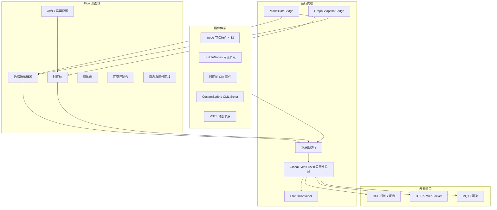

# Flow

**Flow** 是一款面向演出、展陈与现场控制的**可视化节点编排软件**。它将**数据流编辑器**、**时间轴**与**外部协议控制**整合在同一套工程中，让你用「连线」的方式搭建灯光、音视频、设备通信与自动化逻辑，而无需编写大量底层代码。

同时提供无界面版本 **FlowRuntime**，适合部署在控台、服务器或长期运行的现场环境。

---

## 适用场景

| 场景 | 典型用法 |
|------|----------|
| 灯光控制 | Art-Net / DMX 收发、Universe 录制与回放、与 Reaper 等 DAW 联动 |
| 音视频 | 摄像头 / NDI / Spout / RTSP 采集，解码播放，VST3 效果链，LTC 时间码 |
| 设备通信 | 串口、TCP/UDP、WebSocket、HTTP、OSC、MQTT、Modbus TCP |
| 现场自动化 | 热键触发、条件分支、边沿检测、延迟队列、值查表、Snapshot 切场、脚本扩展 |
| AI 视觉 | YOLO 目标/姿态/人脸检测（ONNX）、MediaPipe 手势/姿态/分割、风格迁移 |
| 远程控制 | 内置 HTTP 网页控制台、全局 OSC 地址树、计划任务 |

---

## 程序组成

| 程序 | 用途 |
|------|------|
| **Flow** | 完整 GUI：编辑、调试、预览、媒体管理 |
| **FlowRuntime** | 无界面后台运行：加载同一套 `.flow` 工程，保留 HTTP 服务、系统托盘、插件加载与数据流执行 |

两者**互斥单实例**（不可同时运行）。

---

## 核心架构


```mermaid
flowchart TB
    subgraph UI["Flow 桌面端"]
        DF[数据流编辑器]
        TL[时间轴]
        ST[舞台 / 屏幕视图]
        ML[媒体库]
        EC[网页控制台]
        LG[日志与属性面板]
    end

    subgraph Runtime["运行内核"]
        NP[节点图执行]
        EV[GlobalEventBus 全局事件总线]
        BR[ModelDataBridge]
        GS[GraphSnapshotBridge]
        SC[StatusContainer]
    end

    subgraph External["外部接口"]
        OSC[OSC 控制 / 反馈]
        HTTP[HTTP / WebSocket]
        MQTT[MQTT 可选]
    end

    subgraph Plugins["插件体系"]
        Nodes[".node 节点插件 × 83"]
        BuildIn[BuildInNodes 内置节点]
        Clips["时间轴 Clip 插件"]
        JS["CustomScript / QML Script"]
        VST["VST3 动态节点"]
    end

    DF --> NP
    TL --> NP
    ST --> TL
    NP --> EV
    EV --> OSC
    EV --> HTTP
    EV --> MQTT
    EV --> SC
    Plugins --> NP
    BR --> DF
    BR --> TL
    GS --> DF
```

**一条工程（`.flow`）通常包含：**

- 一个或多个**数据流**（DataFlow）：节点图、连线、参数
- **时间轴**（Timeline）：按时间编排的片段（Clip）
- **舞台**（Stage）：与时间轴关联的可视化布局
- **媒体库**、**计划任务**、**外部控制**配置

数据流之间可通过 **ModelDataBridge** 与时间轴、子流程（`.childflow`）互相驱动，实现「时间轴控节点、节点控时间轴」的双向联动。**GraphSnapshotBridge** 为 Snapshot 节点提供图级快照捕获与召回能力。

---

## 主要功能模块

### 1. 数据流编辑器

基于 [QtNodes](https://github.com/bwll1989/nodeeditor) 的可视化节点图：

- 拖拽节点、连接端口、分组、撤销/重做
- 多个数据流标签页，每个数据流独立运行
- 节点内嵌参数面板；部分节点支持动态端口数量
- **BuildInNodes** 静态库提供 Source / Variable / In / Out / Image Show / Window Display 等基础节点
- **83 个官方 `.node` 插件**，注册 **110+ 节点模型**（部分插件含多个变体），按类别组织在节点库中

每个节点插件目录下均有面向用户的 **`Doc.md`**（节点说明、端口、界面、用法、示例）。

### 2. 时间轴

基于 [QtTimeLine](https://github.com/bwll1989/QtTimeLine) 的非线性时间编排：

- 多轨道、多片段、缩放与播放控制
- 支持 **LTC / MTC / 音频 / 视频** 等同步方式
- 与 TimeLineNode 及 GlobalEventBus 联动
- 可通过 WebSocket 远程控制 NodePlayer

**当前启用的 Clip 插件**（见 `src/Clips/CMakeLists.txt`）：

| Clip | 说明 |
|------|------|
| VideoClip | 视频片段播放 |
| ImageClip | 图片序列 / 静态图 |
| ArtnetClip | Art-Net 数据发送 |
| MappingClip | 数据映射片段 |
| TriggerClip | 触发类事件 |

> AudioClip、PlayerClip 源码存在，默认未纳入构建。

### 3. 外部控制与网页控制台

Flow 通过 **GlobalEventBus** 将节点参数映射为统一的 OSC 风格地址树，便于外部系统读写。

**典型地址格式：**

```
/dataflow/{数据流别名}/{节点ID}/{参数路径}
/timeline/{...}
```

**默认端口**（可在系统设置中修改，定义见 `ConstantDefines.h`）：

| 通道 | 默认端口 | 说明 |
|------|----------|------|
| OSC 反馈 | 8990 | 向外推送状态 |
| OSC 控制 | 8991 | 接收外部控制 |
| HTTP / WebSocket | 8992 | 网页控制台 |

**控制方式：**

| 方式 | 说明 |
|------|------|
| OSC | 节点 Q_PROPERTY 与 ExternalBinding 自动暴露为地址 |
| HTTP / WebSocket | 菜单 **工具 → 打开网页控制台**（默认 `http://127.0.0.1:8992`） |
| MQTT | 可选启用，主题 `flow/control` / `flow/feedback` |
| 计划任务 | 日历式定时触发，与时间轴 / 数据流配合 |

网页控制台支持项目上传下载、媒体上传、Dashboard 布局保存等 API，适合平板或远程运维。

### 4. 插件化扩展

**Internal Commands** 插件提供三种节点变体：

| 变体 | 类别 | 说明 |
|------|------|------|
| Internal Commands | Controls | 批量发送应用内 OSC 命令（StatusContainer） |
| Osc Out Group | Connect | 批量向外部发送 OSC |
| Snapshot | Controls | 捕获选中节点的 `save()` 状态，一键 `load()` 召回 |

Snapshot 典型流程：画布选中节点 →「捕获选中」→ 点击互斥预设按钮恢复参数。**按节点 ID 绑定**，不重建节点、不改变连线拓扑。工程 load 后会自动召回活动预设。

> 各节点需在 `save()/load()` 中完整持久化运行时状态（如播放中、设备连接参数等），Snapshot 才能正确切场。详见各节点 `Doc.md`。

### 5. 插件化扩展

| 类型 | 输出位置 | 说明 |
|------|----------|------|
| C++ 节点插件 | `bin/plugins/DataFlow/*.node` | 参考 `src/Nodes/<NodeName>/` |
| JS 自定义节点 | 运行时扫描 JS 目录 | CustomScriptNode |
| QML Script 节点 | 同上 | 支持 `setUiSchema` 声明式面板 |
| VST3 插件 | `<程序目录>/plugins/VST3/*.vst3` | 每个插件注册为独立节点 |
| 时间轴片段 | Clip 插件 | 参考 `src/Clips/` |

菜单 **插件 → 插件管理器** 可加载 / 卸载节点；**插件 → 打开插件文件夹** 快速定位插件目录。

CMake 选项 **`BUILD_ALL_NODES`**（默认 ON）可一次编译全部节点插件。

---

## 节点库概览

官方节点按 **PLUGIN_TAG** 分为以下类别。完整插件列表见 [`src/Nodes/CMakeLists.txt`](src/Nodes/CMakeLists.txt) 中的 `ALL_NODES`；各节点详细说明见对应目录下的 `Doc.md`。

### Controls — 控制与逻辑

Delay、Switch、Merge、Condition、Edge Trigger、Count、Range Map、Hold、Inject、Distribute、Value Lookup、Keyboard In、Extract、LFO、Curve、Math / Logic 运算、TimeLineNode、Data Info、Data Visual、File Load（JSON / INI / Image）、To Files（图像 / 视频 / 音频 / 文本导出）、JavaScript、QML Script、CustomScript、Internal Commands、Snapshot 等。

### Connect — 网络与协议

Serial Port、TCP Server / Client、UDP Socket、WebSocket Server / Client、HTTP Client、OSC In / Out、Mqtt Client、PJLink。

### Image — 图像与视频

Camera、Capture、ROI、Scale / Crop / Threshold / Switch 等 Image Operates 算子集、NDI In / Out、Spout In / Out、RTSP、Color 系列、Video Decoder、Image Const / Text To Image / Image Layout、Rect、Size Var 等。

### Audio — 音频

Audio Device In / Out、Audio Decoder、Noise Generator、Audio Matrix、Ducking / CrossFader / Priority、LTC Decoder / Generator、Fmod、VST3（动态扫描）、Audio Analysis。

### DMX — 灯光

Artnet In / Out、DMX Device、DMX Universe、Universe Playback。

### Devices — 现场设备

Mpv Controller、VLC Remote、NDV Server / Player、PLC ModBus、DAW Controller、TSETL、showStoreGBx、USR-IO808 / USR-IO424、Aurora S 等。

### ONNX — AI 推理

Object Detection、Pose Detection、Face Detection、Style Transfer（YOLO v11n）、MediaPipe 手部 / 姿态 / 人体分割。

### 未纳入默认构建的节点

以下目录存在源码，但不在 `ALL_NODES` 中或 CMake 已注释：**LuaScriptNode**、**PythonScriptNode**、**ImageCompareNode**、**HttpRestClientNode**。

---

## 快速开始

### 运行

1. 启动 **Flow.exe**
2. **文件 → 打开文件**，选择 `.flow` 工程；或命令行：`Flow.exe "path/to/project.flow"`
3. 从底部**节点库**拖拽节点到画布，连接端口
4. 需要远程控制时，打开 **工具 → 打开网页控制台**

### 工程与数据目录

| 类型 | 默认位置（Windows） |
|------|---------------------|
| 工程文件 `.flow` | 用户自选路径 |
| 子数据流 `.childflow` | 与主工程同目录或相对引用 |
| 媒体库 | `文档/Flow/Medias` |
| 默认 Flow 目录 | `文档/Flow/Flows` |
| 日志 | `文档/Flow/Logs` |
| 配置 / 最近文件 | `文档/Flow/Cfg` |
| 崩溃恢复 | `文档/Flow/Recovery` |

子数据流适合模块化复用（如「音频子系统」「灯光子系统」）。

### 示例工程

`example/` 目录提供可直接打开的流程示例：

| 目录 | 说明 |
|------|------|
| `Artnet controls` / `ArtnetPlayback` | Art-Net 控制与回放 |
| `Artnet to Reaper` | Art-Net 驱动 Reaper |
| `Audio Play` / `AudioMatrix` / `Audio Analyzer` | 音频播放、矩阵与分析 |
| `NDI in and out` | NDI 视频流 |
| `DataMappings` | 时间轴与数据流映射 |
| `Signal Condition` / `Signal Count` / `Signal hold` | 信号处理 |
| `PJLink` / `NDV Control` / `TSETL` | 设备控制 |
| `capture camera` | 摄像头采集 |
| `calculator` / `JSScripts` | JavaScript 脚本示例 |
| `MCPInterfaceTest` | MCP / 外部 AI 接口联调（含 Python 适配器） |
| `DifyMqttControl` | MQTT 与 Dify 集成示例 |

---

## 构建说明

### 环境要求

| 项目 | 要求 |
|------|------|
| 平台 | Windows 64 位 |
| 编译器 | Visual Studio 2019 / 2022（MSVC） |
| Qt | 6.5+（CMakeLists 默认 `C:/Qt/6.5.3/msvc2019_64`，需按本机修改） |
| CMake | 3.10+ |
| 语言标准 | C++17 |

**第三方依赖** 见 [`res/README.md`](res/README.md)（开源声明与致谢）。预编译库位于 `3rdParty/`。

### 编译命令

```bash
cmake -B build -DCMAKE_BUILD_TYPE=Release
cmake --build build --config Release
```

### 输出目录

```
build/bin/Flow.exe
build/bin/FlowRuntime.exe
build/bin/plugins/DataFlow/*.node
```

---

## 项目结构

```
NodeEditorCPP/
├── main.cpp                      # Flow 入口
├── headless_main.cpp             # FlowRuntime 入口
├── CMakeLists.txt                # 主工程与依赖配置
├── src/
│   ├── Nodes/                    # C++ 节点插件（每目录编译为一个 .node）
│   │   ├── CMakeLists.txt        # ALL_NODES 列表
│   │   ├── BuildInNodes/         # 内置节点静态库
│   │   └── <NodeName>/           # 插件源码 + Doc.md
│   ├── Clips/                    # 时间轴片段插件
│   ├── Common/
│   │   ├── AppConfig/            # 配置、常量、自动保存
│   │   ├── BaseClass/            # AbstractDelegateModel 等基类
│   │   ├── DataTypes/            # Image / Audio / Variable 等数据类型
│   │   ├── Devices/              # 设备驱动与桥接
│   │   │   ├── StatusContainer/  # 全局事件总线
│   │   │   ├── ModelDataBridge/  # 数据流 ↔ 时间轴桥接
│   │   │   ├── GraphSnapshotBridge/  # Snapshot 图级快照
│   │   │   ├── MediaLibrary/     # 媒体库
│   │   │   └── ...               # OSC / MQTT / Artnet / TCP 等
│   │   └── GUI/                  # 通用 UI 组件
│   └── Widget/                   # 主窗口与各功能面板
│       ├── MainWindow/
│       ├── NodeWidget/           # 数据流视图与 GraphModel
│       ├── TimeLineWidget/
│       ├── ExternalControl/      # HTTP 服务与网页控制台
│       ├── MediaLibraryWidget/
│       └── ...
├── example/                      # 示例 .flow / .childflow 工程
├── res/                          # 资源、样式、第三方说明
└── 3rdParty/                     # 预编译依赖（QtNodes、FFmpeg、OpenCV 等）
```

---

## 自定义开发

### 新增 C++ 节点

1. 复制 `src/Nodes/` 下任一节点目录
2. 实现 `*DataModel`（继承 `AbstractDelegateModel`）与 `PluginDefinition`
3. 将目录名加入 `src/Nodes/CMakeLists.txt` 的 `ALL_NODES`
4. 编译后 `.node` 输出至 `bin/plugins/DataFlow/`
5. 在目录内维护 `Doc.md`（建议五段结构：说明 / 端口 / 界面 / 用法 / 示例）

### 持久化与 Snapshot

节点若需被工程 save/load 或 Snapshot 正确召回，应重写：

- `save()` — 序列化全部需恢复的状态
- `load()` — 异步初始化（如解码器、设备连接）完成后，再恢复播放 / 连接等运行时状态

### JS / QML 节点

- **CustomScriptNode**：在扫描目录放置 JS，通过元数据声明 `name`、`inputs`、`outputs` 与 UI
- **QmlScriptNode**：支持 `setUiSchema` 声明式面板

### 时间轴片段

参考 `src/Clips/VideoClip` 等，实现 `AbstractClipDelegateModel`。

---

## 路线图

- [ ] 优化性能与长时间运行稳定性
- [ ] 扩展节点类型（音频 / 视频 / 控制 / 设备对接）
- [ ] 增强时间轴功能（编辑体验、同步精度）
- [ ] 完善 Dashboard / 网页控制台集成度
- [ ] 统一节点 `save()/load()` 与 Snapshot 兼容性
- [ ] 优化交互与文档体系

---

## 许可证与致谢

Copyright © 2008–2026 WuBin. All rights reserved.

本项目使用了第三方开源项目及 SDK，声明与致谢见 [`res/README.md`](res/README.md)。
