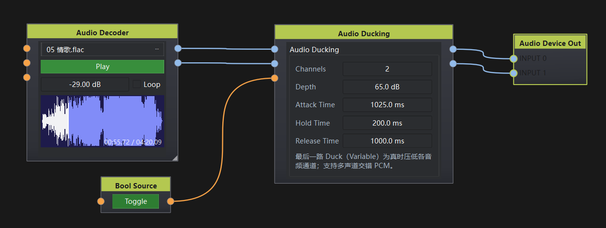

# Audio Ducking

## 1. 节点说明

用 **VariableData** 触发的多通道闪避：Duck 为真时，各音频通道按 Depth 衰减；为假后经 Hold / Release 恢复。不再用侧链音频检测。

## 2. 端口说明

用 **Channels** 配置音频路数（1–64，默认 2）。输入比输出多一路 Duck。

### 输入

- **In 1 … In N**（AudioData）：被压低的节目通道，可为单声道或多声道交错 PCM。
- **Duck**（VariableData）：触发。`true` / 非 0 开始闪避，`false` / 0 进入 Hold→Release。

### 输出

- **Out 1 … Out N**（AudioData）：与各 In 一一对应，施加闪避增益后输出。

## 3. 参数

- **Channels**（1 ~ 64）：音频通道数。
- **Depth**（0 ~ 100 dB）：闪避时的衰减量。
- **Attack Time**（5 ms ~ 10 s）：落到 Depth 的时间常数。
- **Hold Time**（1 ms ~ 30 s）：Duck 变假后继续保持衰减的时间。
- **Release Time**（10 ms ~ 10 s）：保持结束后回到 0 dB 的时间常数。

也可通过 OSC `/duck` 直接触发。

## 4. 使用说明

1. 用 Channels 设好音频路数。
2. 各节目接到 In，Bool / Trigger / 逻辑节点接到 Duck。
3. Out 接到声卡或下级处理。
