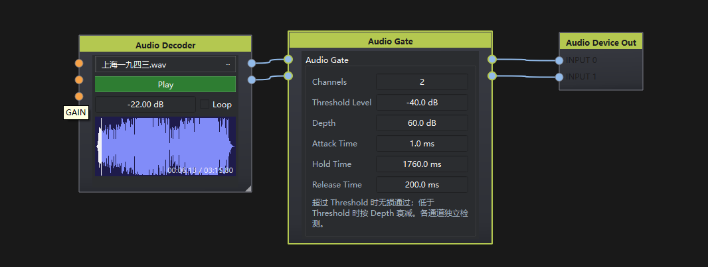

# Audio Gate

## 1. 节点说明

QSC Noise Gate：各通道根据自身 RMS 开/关。超过 **Threshold Level** 时信号**无损通过**；低于阈值时按 **Depth** 衰减。带 Attack / Hold / Release，避免语句停顿时门反复开关。

## 2. 端口说明

用 **Channels** 配置路数（1–64，默认 1），输入与输出一一对应。

### 输入

- **In 1 … In N**（AudioData）：节目通道，可为单声道或多声道交错 PCM。各路独立检测。

### 输出

- **Out 1 … Out N**（AudioData）：门控后的对应输出。

## 3. 参数

- **Channels**（1 ~ 64）：通道数。
- **Threshold Level**（-60 ~ 20 dB）：开闸门限（RMS）。
- **Depth**（0 ~ 60 dB）：低于门限时的衰减量；60 dB 接近静音。
- **Attack Time**（0.1 ms ~ 10 s）：超过门限后增益升到 0 dB 的时间常数。
- **Hold Time**（10 ms ~ 10 s）：低于门限后继续保持打开的时间。
- **Release Time**（10 ms ~ 10 s）：Hold 结束后衰减到 Depth 的时间常数。

## 4. 使用说明

1. 用 Channels 设好路数。
2. 话筒等接到 In，Out 接下级处理。
3. 调 Threshold 使有说话时打开、安静时关闭；调 Depth / 时间常数避免呼吸噪声和断句咔嗒声。
