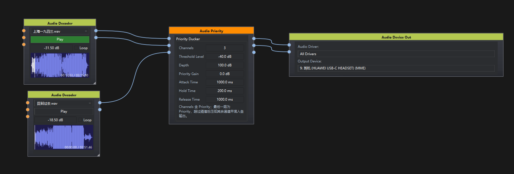

# Audio Priority

## 1. 节点说明

QSC Priority Ducker：最后一路输入为 Priority。当它的 RMS 超过 Threshold Level 时，其余通道按 Depth 衰减，并把带 Priority Gain 的 Priority 混进这些输出；低于阈值后经 Hold / Release 恢复节目电平，并停止混入。适合紧急广播、解说压过背景音乐。

## 2. 端口说明

用 **Channels** 配置节目音频路数（1–64，默认 2，不含 Priority）。输入与输出均为 Channels + 1，最后一路为 Priority。

### 输入

- **In 1 … In N**（AudioData）：普通节目通道，可为单声道或多声道交错 PCM。
- **Priority**（AudioData）：优先级 / 基准音频。超过阈值后压低所有其他输入。

### 输出

- **Out 1 … Out N**（AudioData）：对应输入衰减后，再在 Priority 激活时混入 Priority。
- **Priority**（AudioData）：仅 Priority，并施加 Priority Gain。

## 3. 参数

- **Channels**（1 ~ 64）：节目音频通道数（不含 Priority）。
- **Threshold Level**（-60 ~ 20 dB）：Priority 的 RMS 达到该值后开始闪避。
- **Depth**（0 ~ 100 dB）：闪避时普通通道的衰减量。约 60 dB 相当于基本静音。
- **Priority Gain**（-100 ~ 20 dB）：混入输出时 Priority 的增益。
- **Attack Time**（5 ms ~ 10 s）：普通通道落到 Depth 的 63% 所需时间。
- **Hold Time**（1 ms ~ 30 s）：Priority 低于阈值后，继续保持衰减的时间，避免语句停顿把背景顶回来。
- **Release Time**（10 ms ~ 10 s）：保持结束后，普通通道回到正常电平 63% 所需时间。

## 4. 使用说明

1. 用 Channels 设好节目路数（不含 Priority）。
2. 背景、分区等节目接到 In 1、In 2…，话筒或警报接到最后一路 Priority。
3. 各 Out 接到对应区域。Priority 超过阈值时，这些输出里的节目被压低，同时听到 Priority；低于阈值后经 Hold/Release 恢复。
