# Int Source

## 1. 节点说明

整数常量源。内嵌拖拽数值框，输出当前整数值；输入口可覆盖。值写入工程。

## 2. 端口说明

| 方向 | 端口 | 类型 | 说明 |
|------|------|------|------|
| 入 | （默认） | VariableData | 覆盖当前整数；断开时置 0 |
| 出 | （默认） | VariableData | 当前整数 |

## 3. 界面说明

`IntDragValueWidget`。外部控制：`/int`。

## 4. 使用说明

拖拽或 OSC 改值；需要记忆时用 Source，仅运行时用 Int Variable。

## 5. 示例
### 数学运算
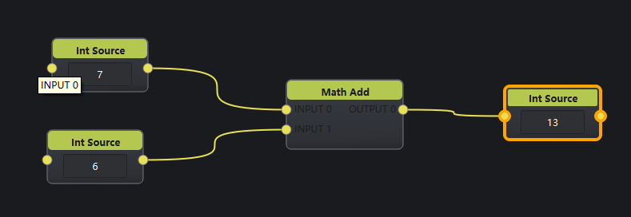
### 转bool类型
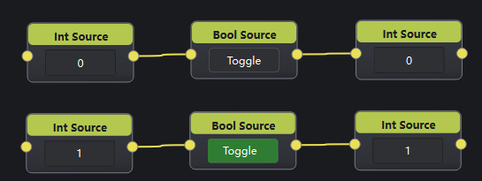
---

# Int Variable

## 1. 节点说明

与 Int Source 相同的端口与界面，**工程不持久化数值**（即保存时不会保存当前值，下次打开恢复默认）。

## 2. 端口说明

同 Int Source。

## 3. 界面说明

同 Int Source。外部控制：`/int`。

## 4. 使用说明

作中间计数、临时索引；切场不恢复时用本节点。

## 5. 示例

同`Int Source`。

---

# Float Source

## 1. 节点说明

浮点常量源。内嵌浮点拖拽控件，值可持久化。

## 2. 端口说明

| 方向 | 类型 | 说明 |
|------|------|------|
| 入 | VariableData | 覆盖当前浮点 |
| 出 | VariableData | 当前浮点 |

## 3. 界面说明

浮点拖拽控件。外部控制：`/float`。

## 4. 使用说明

增益、混合比、阈值等可复现参数。

## 5. 示例

### 数学运算
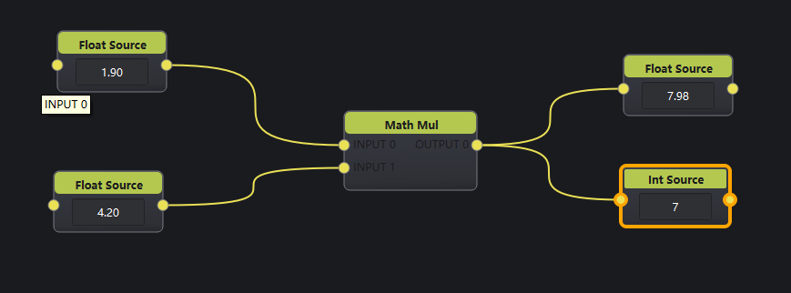
### 类型转换
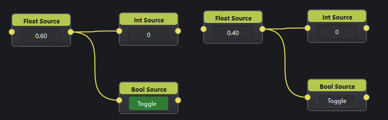
### 
---

# Float Variable

## 1. 节点说明

浮点运行时变量；界面与端口同 Float Source，**不持久化**。

## 2. 端口说明

同 Float Source。

## 3. 界面说明

外部控制：`/float`。

## 4. 使用说明

LFO / 分析节点的中间结果暂存。

## 5. 示例

同 `Float Source`。

---

# String Source

## 1. 节点说明

字符串常量源。内嵌单行编辑框，值可持久化。支持与float、int、bool间动态类型转换

## 2. 端口说明

| 方向 | 类型 | 说明 |
|------|------|------|
| 入 | VariableData | 覆盖字符串 |
| 出 | VariableData | 当前字符串 |

## 3. 界面说明

`QLineEdit`。外部控制：`/string`。

## 4. 使用说明

文件名、OSC 地址片段、设备 ID 等。

## 5. 示例

### 数学运算
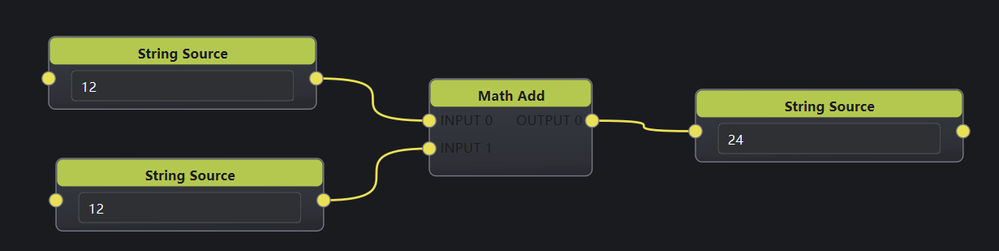
### 数值转换
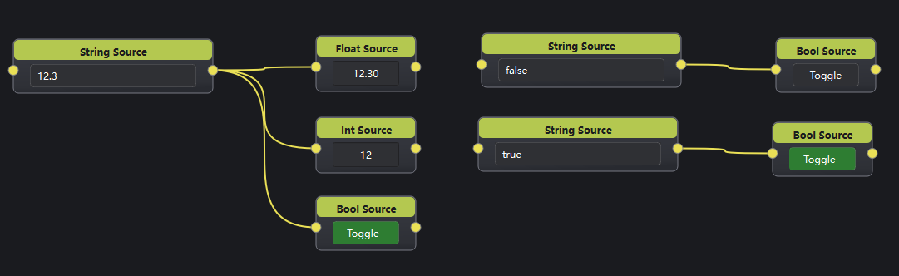
---

# String Variable

## 1. 节点说明

字符串运行时变量；不持久化。外部控制：`/string`。

## 2. 端口说明

同 String Source。

## 3. 界面说明

同 String Source。

## 4. 使用说明

动态文案、临时路径。

## 5. 示例

Extract 字符串字段 → String Variable → To JSON。

---

# Bool Source

## 1. 节点说明

布尔常量源。内嵌勾选按钮，值可持久化。

## 2. 端口说明

| 方向 | 类型 | 说明 |
|------|------|------|
| 入 | VariableData | 覆盖布尔 |
| 出 | VariableData | 当前布尔 |

## 3. 界面说明

可勾选按钮。外部控制：`/bool`。

## 4. 使用说明

开关类默认状态、使能标志。

## 5. 示例

### 类型转换
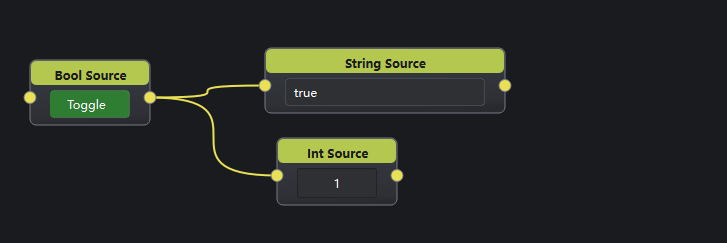
### 逻辑运算
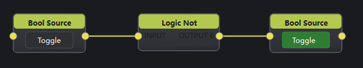
---

# Bool Variable

## 1. 节点说明

布尔运行时变量；不持久化。外部控制：`/bool`。

## 2. 端口说明

同 Bool Source。

## 3. 界面说明

同 Bool Source。

## 4. 使用说明

边沿检测、临时互锁位。

## 5. 示例

同 Bool Source。

---

# Toggle Source

## 1. 节点说明

可锁定的布尔开关（Checkable 按钮）。点击切换真假，值可持久化。

## 2. 端口说明

| 方向 | 类型 | 说明 |
|------|------|------|
| 入 | VariableData | 覆盖开关状态 |
| 出 | VariableData | 当前布尔 |

## 3. 界面说明

「Toggle」按钮（可勾选）。外部控制：`/bool`。

## 4. 使用说明

需要手动拨动且记住状态的开关。

## 5. 示例

同 Bool Source。

---

# Toggle Variable

## 1. 节点说明

与 Bool Source。 相同交互，**不持久化**。外部控制：`/bool`。

## 2. 端口说明

同 Bool Source。

## 3. 界面说明

同 Bool Source。

## 4. 使用说明

演出中临时拨动、不进工程快照的开关。

## 5. 示例

同 Bool Source。

---

# Trigger Source

## 1. 节点说明

脉冲触发器：点击按钮或输入口收到 `true` 时，输出一次触发脉冲（读出后内部复位）。适合驱动 Inject、Internal Commands、Delay 等「一次性动作」节点。

## 2. 端口说明

| 方向 | 类型 | 说明 |
|------|------|------|
| 入 | VariableData | 为 `true` 时触发 |
| 出 | VariableData | 触发瞬间为真脉冲 |

## 3. 界面说明

`TriggerWidget`（Trigger 按钮）。外部控制：`/trigger`（`true` 时触发）。

## 4. 使用说明

1. 点击按钮或向输入送 `true`。
2. 将输出接到需要脉冲的下游。

## 5. 示例

### 脉冲计数
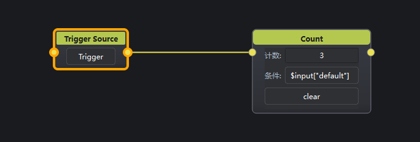

---

# Vector Source

## 1. 节点说明

可变长度向量源。分量是 **float 列表**，输出 **VariableData**（`default` 为列表）。维数由 Size 决定；输入端口可编辑（默认 5 路，末口为整段向量）。

## 2. 端口说明

### 输入

| 端口 | 名称 | 说明 |
|------|------|------|
| 0 … n-2 | `0`… | 覆盖对应下标分量（超出当前 Size 则忽略） |
| n-1 | Vec | 整段向量；按当前 Size 截断或补 0 |

### 输出

| 端口 | 类型 | 说明 |
|------|------|------|
| Vec | VariableData | `default` 为当前 float 列表 |

## 3. 界面说明

- **N**：分量个数（1–16）
- 下方按 0、1、2… 编辑各分量

## 4. 使用说明

改 Size 只影响向量长度，不会增删端口；改端口数量也不会改 Size。解析统一走 `floatVectorFromVariant`（列表 / 标量 / 旧几何类型均可）。

## 5. 示例
### 数据构建
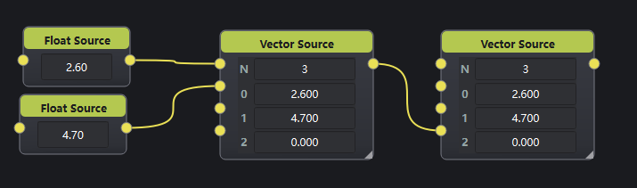
### 转颜色数据
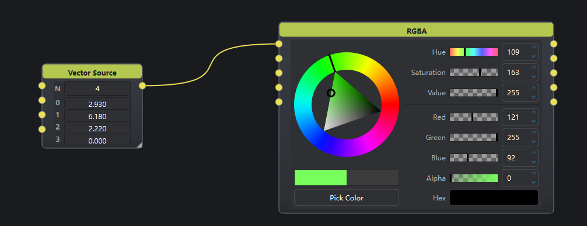
---

# To JSON

## 1. 节点说明

将字符串解析为 VariableData（JSON 对象）。内嵌可缩放文本框：若文本为合法 JSON **对象**，输出其键值表；否则将原文放入 `default` 字段。

## 2. 端口说明

| 方向 | 名称 | 类型 | 说明 |
|------|------|------|------|
| 入 | STRING | VariableData | 字符串写入编辑框 |
| 出 | JSON | VariableData | 解析后的对象或 `{default: 原文}` |

## 3. 界面说明

`QPlainTextEdit`（`Resizable=true`）。编辑即刷新输出。文本写入工程。

## 4. 使用说明

1. 粘贴或输入 JSON；或由上游字符串写入。
2. 下游用 Extract / Condition 读字段。

## 5. 示例

### 文本转json
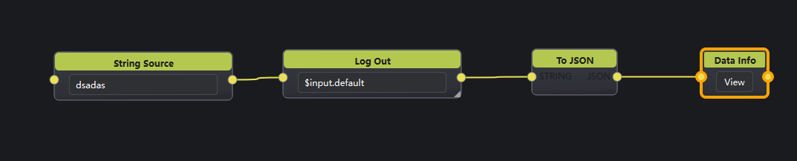

---

# From JSON

## 1. 节点说明

将 VariableData 转为 JSON 文本字符串输出。输入调用 `toJsonString()` 填入编辑框；输出为编辑框纯文本。

## 2. 端口说明

| 方向 | 名称 | 类型 | 说明 |
|------|------|------|------|
| 入 | JSON | VariableData | 对象/表 → 文本 |
| 出 | STRING | VariableData | 当前文本 |

## 3. 界面说明

`QPlainTextEdit`。文本可持久化；手动改文本也会更新输出。

## 4. 使用说明

调试查看对象结构，或把结构化数据发给只收字符串的节点。

## 5. 示例
### JSON转文本
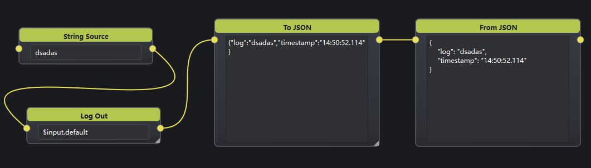
### Variable转文本
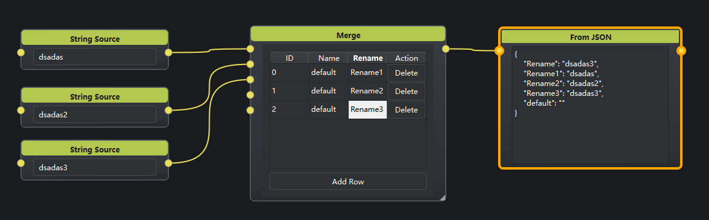
---

# Container

## 1. 节点说明

**子图封装**节点：内部维护一张独立的数据流图（`inner-scene`），外壳端口由子图内全部 **Variable / Image / Audio** 的 In/Out 接口节点汇总暴露。

- 多个 **In** 节点：各自 **Out** 口依次映射到 Container 外壳 **In** 口。
- 多个 **Out** 节点：各自 **In** 口依次映射到 Container 外壳 **Out** 口。
- 双击 Container 进入子图编辑；面包屑返回时自动 `syncInterfaceFromInner` 刷新外壳端口。
- 新建空 Container 时默认放入一对 **Variable In** + **Variable Out**。
- 支持嵌套 Container（`modelAlias` 为 `父别名/节点Id` 链式路径）。
- 子图随 Container 节点一并写入工程（`inner-scene` 字段）。

## 2. 端口说明

外壳端口**数量与类型**由子图接口节点动态决定，不可手动编辑（`PortEditable=false`）。

| 方向 | 类型 | 说明 |
|------|------|------|
| 入 | 随映射 | 外层数据 → 对应 In 节点的 Out 口 |
| 出 | 随映射 | 对应 Out 节点的 In 口 → 外层数据 |

端口标题（caption）取接口节点 **remarks 第一行** + 本地端口序号（如 `score.0`）；同备注重名时加 `#节点Id` 消歧（如 `score#12.0`）。接口节点增删或改 remarks 时，外壳端口会自动增减并刷新标签。

## 3. 界面说明

无内嵌控件。双击进入子图画布；子图使用与主流程相同的节点库与编辑能力。

## 4. 使用说明

1. 放置 Container，双击进入子图。
2. 在子图内添加 **Variable/Image/Audio In/Out**，按需增删端口（`PortEditable=true`）。
3. 为 In/Out 设置 **remarks**（第一行作为外壳端口名）；子图内完成内部连线。
4. 返回外层，将外层链路接到 Container 外壳端口。
5. 子图内也可再嵌套 Container，形成分层模块。

## 5. 示例
### 打包Container，并暴露端口
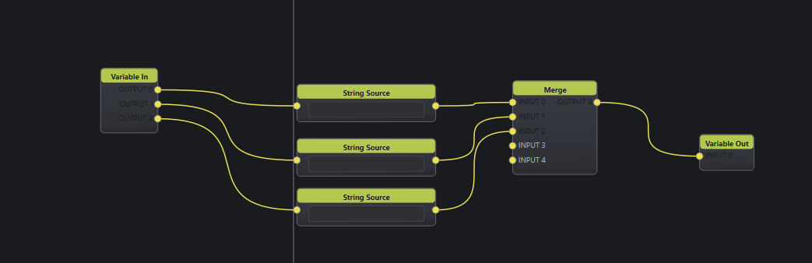
### 直接使用
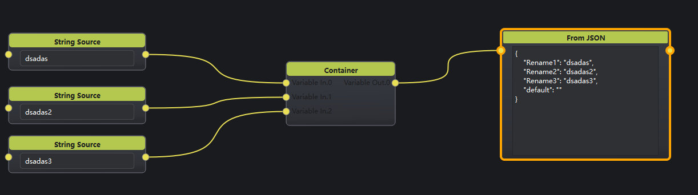
---

# Variable In

## 1. 节点说明

**Container 子图变量入口**：无输入口；外壳 Container 的 In 口注入的数据经 `setInData` 写入后，从本节点 **Out** 口送入子图内部。输出口数量可编辑（`PortEditable=true`）。通常只在 Container 子图内使用。

## 2. 端口说明

| 方向 | 类型 | 说明 |
|------|------|------|
| 出 | VariableData | 外壳注入的变量（可多口） |

## 3. 界面说明

无内嵌控件。**remarks** 第一行用作 Container 外壳 In 口标题。外部控制：`/input`（写入 remarks 字符串）。

## 4. 使用说明

1. 放入 Container 子图，设置 remarks 命名外壳端口。
2. 将子图内下游接到本节点 Out 口。
3. 外层向 Container 对应 In 口送 VariableData 即可驱动子图。

## 5. 示例

同 Container 示例

---

# Variable Out

## 1. 节点说明

**Container 子图变量出口**：子图内部 VariableData 从本节点 **In** 口写入后，由 Container 外壳 **Out** 口中继到外层。无输出口；输入口可编辑（`PortEditable=true`）。

## 2. 端口说明

| 方向 | 类型 | 说明 |
|------|------|------|
| 入 | VariableData | 待导出到外壳的变量（可多口） |

## 3. 界面说明

无内嵌控件。**remarks** 第一行用作 Container 外壳 Out 口标题。

## 4. 使用说明

1. 将子图内计算链路末级接到 Variable Out 的 In 口。
2. 设置 remarks 命名外壳 Out 口。
3. 外层从 Container 对应 Out 口读取数据。

## 5. 示例

同 Container 示例

---

# Image In

## 1. 节点说明

**Container 子图图像入口**：用法同 Variable In，数据类型为 **ImageData**。外壳 Container In 注入图像后，从 Out 口送入子图。外部：`/input`（remarks）。

## 2. 端口说明

| 方向 | 类型 | 说明 |
|------|------|------|
| 出 | ImageData | 外壳注入的图像（可多口） |

## 3. 界面说明

无内嵌控件。**remarks** 第一行用作 Container 外壳 In 口标题。

## 4. 使用说明

1. 在 Container 子图内放置 Image In，设置 remarks。
2. 外层图像源接到 Container 对应 In 口。
3. 子图内从 Image In Out 口继续接 Image 算子或 Display。

## 5. 示例

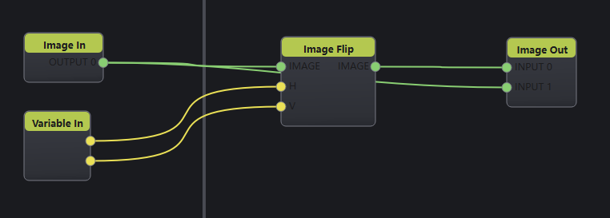
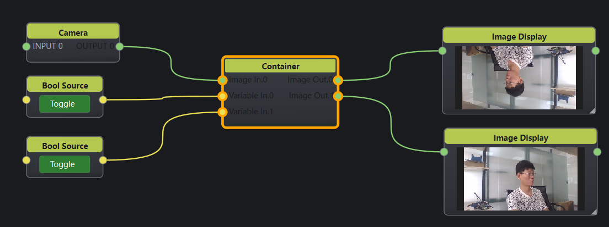
---

# Image Out

## 1. 节点说明

**Container 子图图像出口**：子图内 ImageData 从 In 口写入，由 Container 外壳 Out 中继到外层。无输出口；输入口可编辑。

## 2. 端口说明

| 方向 | 类型 | 说明 |
|------|------|------|
| 入 | ImageData | 待导出到外壳的图像（可多口） |

## 3. 界面说明

无内嵌控件。**remarks** 第一行用作 Container 外壳 Out 口标题。

## 4. 使用说明

将子图内渲染/处理链路末级接到 Image Out，外层从 Container Out 取图。

## 5. 示例

同 Image In 示例

---

# Audio In

## 1. 节点说明

**Container 子图音频入口**：用法同 Variable In，数据类型为 **AudioData**。仅接受已连接共享缓冲区的 AudioData（`isConnectedToSharedBuffer()`）；否则该口输出为空。外部：`/input`（remarks）。

## 2. 端口说明

| 方向 | 类型 | 说明 |
|------|------|------|
| 出 | AudioData | 外壳注入的音频（可多口） |

## 3. 界面说明

无内嵌控件。**remarks** 第一行用作 Container 外壳 In 口标题。

## 4. 使用说明

1. 外层音频源（Decoder、Device In 等共享缓冲链路）接到 Container In。
2. 子图内从 Audio In Out 口接 Audio 处理或 Device Out。

## 5. 示例

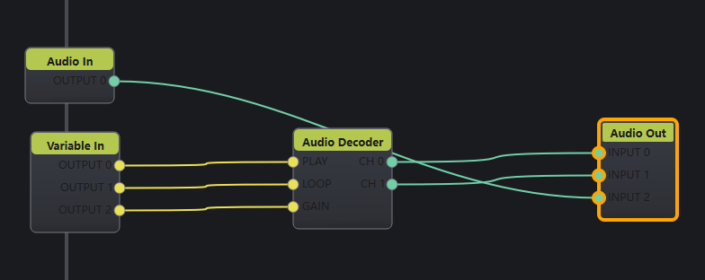
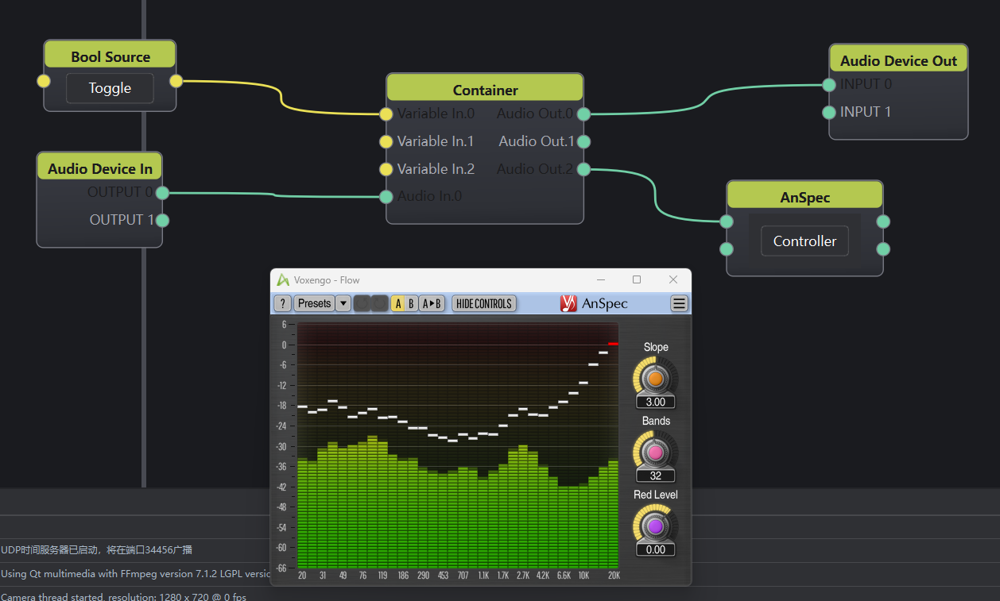
---

# Audio Out

## 1. 节点说明

**Container 子图音频出口**：子图内 AudioData 从 In 口写入，由 Container 外壳 Out 中继到外层。仅缓存已连接共享缓冲区的 AudioData。无输出口；输入口可编辑。

## 2. 端口说明

| 方向 | 类型 | 说明 |
|------|------|------|
| 入 | AudioData | 待导出到外壳的音频（可多口） |

## 3. 界面说明

无内嵌控件。**remarks** 第一行用作 Container 外壳 Out 口标题。

## 4. 使用说明

子图内音频链路末级 → Audio Out → 外层从 Container Out 取音频。

## 5. 示例

同 Audio In 示例
---

# Image Display

## 1. 节点说明

节点内嵌 **GPU 纹理预览**。订阅系统 tick 与 ring buffer 新帧，零拷贝绑定纹理显示；输出与输入为同一 `ImageData` 句柄（透传，不复制像素）。

## 2. 端口说明

| 方向 | 类型 | 说明 |
|------|------|------|
| 入 | ImageData | 待预览图像 |
| 出 | ImageData | 透传同一句柄 |

## 3. 界面说明

`ImageTextureViewHost` 嵌入节点面板。

## 4. 使用说明

接在任意 Image 链路中查看当前帧；可继续往后连算子或 Display。

## 5. 示例

同 Image In示例
---

# Window Display

## 1. 节点说明

在独立 OpenGL 窗口中全屏/开窗显示图像。刷新策略与 Image Display 同源（tick + ring buffer）。可选择目标显示器，并用布尔口控制窗口显隐。

## 2. 端口说明

| 方向 | 端口 | 类型 | 说明 |
|------|------|------|------|
| 入 | 0 | ImageData | 显示图像 |
| 入 | 1 | VariableData | `true`/`false` 打开/关闭窗口 |
| 出 | （默认） | ImageData | 透传输入图像 |

## 3. 界面说明

- **显示器**下拉框：选择目标屏幕  
- **打开窗口**按钮：切换窗口显隐  
工程保存屏幕索引与窗口状态。

## 4. 使用说明

1. 连接图像源到端口 0。  
2. 选择显示器，点「打开窗口」或向端口 1 送布尔。  
3. 退出应用时会关闭显示窗口。

## 5. 示例

Video Decoder → Window Display（副屏演出预览）。
