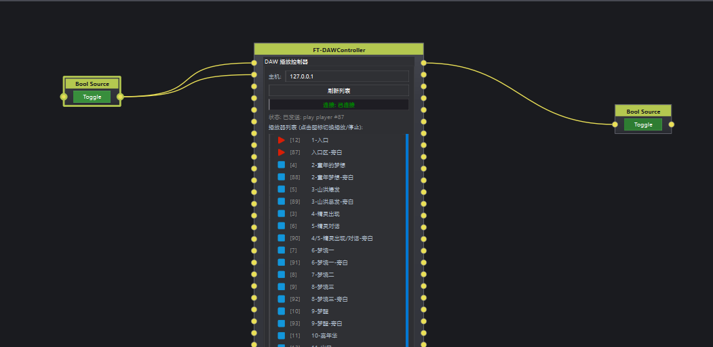

# FT-CurtainController

## 1. 节点说明

通过 TCP 控制 **电动幕帘**：发送开、关、复位指令（协议帧 `C5` + 地址 + 命令 + `5C`），地址取自主机 IP 末段。连接后每 3 秒发送 `HeartBeat` 心跳；收到运行反馈时输出运行状态。

## 2. 端口说明

### 输入

| 端口 | 类型 | 说明 |
|------|------|------|
| OPEN | VariableData | `true` 时打开（命令 `01`） |
| CLOSE | VariableData | `true` 时关闭（命令 `02`） |
| RESET | VariableData | `true` 时复位（命令 `FF`） |

### 输出

| 端口 | 类型 | 说明 |
|------|------|------|
| RUNNING | VariableData | 幕帘是否在运行（布尔，收到执行状态 `0x11` 时为 true） |

## 3. 界面说明

- **主机 / 端口**：幕帘控制器地址（默认端口 10001）。
- **打开 / 关闭 / 复位**：与输入端口等效。
- **连接状态**：TCP 是否连接（`/status`）。

外部控制：`/host`、`/port`、`/open`、`/close`、`/reset`。

## 4. 使用说明

1. 主机 IP 末段须与幕帘编址一致（指令中嵌入该字节）。
2. 连接成功后可用按钮或 OPEN/CLOSE/RESET 输入触发。
3. RUNNING 可接指示灯或互锁逻辑，避免重复动作。
4. 修改主机或端口后会自动重连。

## 5. 示例

场景「演出开始」→ OPEN 输入 `true`；「结束」→ CLOSE；RUNNING 接 Hold 节点，运行中禁止再次打开。

---

# FT-ControlBox

## 1. 节点说明

通过 TCP 接收 **点播盒子** 上报的按键/IO 事件，按 **index** 映射到 8 路短脉冲输出。点播盒子需配置为 TCP Server。

设备三组 IO 共用同一套索引（1～8），节点不校验类型前缀：
- 面板薄膜：`{485地址}$BB^{index}\r\n`
- 遥控器：`{485地址}$YY^{index}\r\n`
- IO 线：`{485地址}$KK^{index}\r\n`

例如 `1$BB^3`、`1$YY^3`、`1$KK^3` 都会触发 **IO 3**。

## 2. 端口说明

### 输入

无输入端口。

### 输出

| 端口 | 类型 | 说明 |
|------|------|------|
| IO 1～8 | VariableData | 对应 index 1～8，触发时输出一次短脉冲 |

说明：
- 节点共 8 个输出端口。
- 每次触发时，对应端口会短暂输出 `true`，随后自动恢复为 `false`。

## 3. 界面说明

- **主机 / 端口**：点播盒子的 TCP 地址（默认 `127.0.0.1:2001`）。
- **485 地址**：用于匹配设备上报消息中的地址编号。
- **连接状态**：TCP 是否连接。
- **IO1～IO8 按钮**：用于手动测试触发，对应输出端口也会同步输出脉冲。

外部控制：
- `/host`
- `/port`
- `/addr485`
- `/connected`（只读状态）
- `/IO1` ～ `/IO8`（状态反馈）

## 4. 使用说明

1. 设置点播盒子的 IP、端口和 485 地址，等待连接成功。
2. 设备上报任一类型消息时，节点按 index 触发对应 IO 端口脉冲。
3. 也可直接点击界面上的 IO 按钮做联调测试。
4. 将 IO 输出接到后续流程节点即可。

## 5. 示例

- `IO 1` 接“播放开场视频”
- `IO 2` 接“切换灯光场景”
- `IO 3` 接“暂停”

面板、遥控或 IO 线只要 index 相同，都会走同一路输出。

---

# FT-LocationProto

## 1. 节点说明

作为 **TCP Protobuf 服务端**，接收外部船只定位系统上报的位置与 RFID 点位信息，并转换为 `VariableData` 输出到下游节点。协议定义见 `perip2s.proto`（perip2s 帧格式）。

定位设备以 TCP 客户端身份连接本节点；节点自动处理心跳与注册握手，无需额外配置。

**支持的入站消息：**

| 命令 ID | 说明 | 节点行为 |
|---------|------|----------|
| `1` | 心跳 `Heartbeat` | 自动回复心跳 |
| `1602` | 定位系统注册 | 自动回复注册成功（`ret = 1`） |
| `1603` | UWB 位置更新 | 输出到 **POS** 端口 |
| `1604` | RFID 点位更新 | 输出到 **POINT** 端口 |

**TCP 帧格式（大端序）：** `[4 字节 data_len][4 字节 msg_id][msg_body]`，其中 `data_len = 4 + msg_body 长度`，`msg_body` 为 Protobuf 序列化数据。

## 2. 端口说明

### 输入

无输入端口。

### 输出

| 端口 | 类型 | 说明 |
|------|------|------|
| POS | VariableData | UWB 位置更新（命令 `1603`） |
| POINT | VariableData | RFID 点位更新（命令 `1604`） |

**POS 输出字段（`P2SBoatPositioningSysUpdatePos`）：**

| 字段 | 类型 | 说明 |
|------|------|------|
| `default` | float 列表 | 位置向量 `[x, y, z]`（由 `pos` 收成，便于下游按向量消费） |
| `boatId` | int | 船只 ID |
| `pos` | object | 位置坐标 `{ x, y, z }`（float，原始嵌套字段保留） |
| `timestamp` | int64 | 13 位毫秒时间戳 |

**POINT 输出字段（`P2SBoatPositioningSysUpdatePoint`）：**

| 字段 | 类型 | 说明 |
|------|------|------|
| `boatId` | int | 船只 ID |
| `pointId` | int | 位置点 ID |
| `timestamp` | int64 | 13 位毫秒时间戳 |

说明：Protobuf 转 JSON 时字段名为驼峰形式（如 `boat_id` → `boatId`）。每次收到对应消息时更新输出并触发下游刷新。

## 3. 界面说明

本节点无可嵌入界面（`WidgetEmbeddable = false`），通过属性与外部控制配置：

- **主机**：监听地址（默认 `0.0.0.0`，表示所有网卡）。
- **端口**：监听端口（默认 `9001`）。
- **listening**（内部属性）：TCP 服务是否已成功监听。

外部控制：

- `/host` — 设置监听地址
- `/port` — 设置监听端口

修改主机或端口后会自动重启 TCP 服务。

## 4. 使用说明

1. 在节点编辑器中添加 **FT-LocationProto**，确认监听端口（默认 `9001`）未被占用。
2. 将定位设备配置为 TCP 客户端，连接到本机 IP 与对应端口。
3. 设备连接后会自动完成注册与心跳；上报位置或点位时，**POS** / **POINT** 端口输出最新数据。
4. 将 POS 输出接到 Extract、Lookup、Distribute 等节点，可按 `default`（`[x,y,z]`）、`boatId`、`pos.x` 等字段做条件分支或数值处理。
5. 将 POINT 输出接到流程触发逻辑，实现“到达某 RFID 点位即触发动作”。

## 5. 示例

- **实时位置驱动显示**：POS → 下游向量口（直接用 `default` 的 `[x,y,z]`），或 Extract（`$input.pos`）→ 显示/映射节点。
- **按船只分流**：POS → Distribute（条件 `$input.boatId == 1` → 端口 0，`$input.boatId == 2` → 端口 1）。
- **到点触发**：POINT → Condition（`$input.pointId == 5`，接 **DATA** 端口）→ 触发对应场景。

定位设备需实现 `perip2s.proto` 中 P2S 侧协议；本节点负责 S2P 侧注册应答与心跳回复。
---

# FT-DAWController

## 1. 节点说明

面向自研 **DAW 控制器**的播放列表驱动节点，与 SPlayControllerNode 的"轮询 + 端口映射"模式对齐：

- 通过 HTTP **GET `http://127.0.0.1:2004/players`**（默认主机 `127.0.0.1`，端口固定 `2004`）每 2 秒轮询一次播放列表。
- 解析返回 JSON 中的 `players[]`（字段：`id / name / type / status / enable / sort`），按 `sort` 升序排序后作为端口顺序。
- **端口数量完全由播放列表驱动，不可手动编辑**：新列表到达后自动增删输入/输出端口，始终保持 **In = N，Out = N**（N = 播放器数量），输入输出端口 i 都对应排序第 i 个播放器。
- 输入端口写 `true` → 向该播放器下发 `play`；写 `false` → 下发 `stop`。
- 指令通过 `FTDAWController` 单例（全局 TCP Client，默认端口 2003）发出，格式严格为：
  ```
  {"type":"player","id":"1","operate":"play"}/0
  ```

## 2. 端口说明

### 输入（全部 VariableData / Bool）

| 端口 | 类型 | 说明 |
|------|------|------|
| `[i] <播放器名称>` | VariableData | 第 i 个播放器控制：写入 `true`=PLAY，`false`=STOP；每次写入都发令，便于 Trigger 再次 true 重放 |

### 输出（全部 VariableData / Bool）

| 端口 | 类型 | 说明 |
|------|------|------|
| `[i] <播放器名称>` | VariableData | 第 i 个播放器当前是否在播放（`isPlayingStatus()` 判定）；**仅状态变化时才输出** |

> 删除播放器后对应输入/输出端口会自动减少（按 QtNodes 约定先发 `portsAboutToBeDeleted` 再 `portsDeleted`）；连线会按框架策略处理。

## 3. 界面说明

- **主机**：DAW HTTP 接口所在主机（默认 `127.0.0.1`）；编辑框回车后立即重连并刷新一次列表，HTTP 端口固定为 `2004`。
- **刷新列表**：立即手动 `GET /players` 一次。
- **连接状态**：
  - 绿/已连接 = 最近一次 `/players` 请求成功；
  - 红/未连接 = 连续失败或从未成功。
  - 下方灰色状态栏显示最近请求提示（请求中 / 加载 N 个 / JSON 解析失败 / 超时原因等）。
- **播放器列表（点击图标切换播放/停止）**：每行结构
  - `[播放/停止按钮]`（checkable，图标 = `:/icons/icons/play.png` / `stop.png`，无背景）：点击即 toggle 该播放器；
  - `[<真实ID>]`：接口返回的 `players[i].id`；
  - `<名称>`：`players[i].name`，鼠标悬停显示完整字段（index / id / name / type / status / enable / sort）。
  - 正在播放的行自带淡绿底色；已启用但未播放为淡蓝底色。

### OSC 外部控制

| 相对地址 | 说明 |
|---|---|
| `/host` | 写入新主机字符串（同时自动刷新一次） |
| `/refresh` | 写入 `true` 立即刷新列表 |

> 节点持久化字段：**host**（兼容旧版存档中的 `IP` / `port` 字段，port 字段已忽略，内部固定 2004）。

## 4. 使用说明

1. 若 DAW HTTP 接口不在本机，将 **主机** 改为对应 IP（端口 2004 由 DAW 提供，无需配置）。
2. 等状态栏显示 "已加载 N 个播放器"，节点左右两侧会出现对应数量的控制 / 状态端口。
3. 上游连线：
   - 直接 Bool 驱动：某条件成立 → `In[i]=true` 开始播放，条件失效 → `In[i]=false` 停止；
   - 脉冲驱动：Trigger 脉冲 → `In[i]=true` 开始播放，再次 true 也会重新发 play（因为每次写入都发令）。
4. 下游：把 `Out[i]` 接 DataInfo / Condition，仅在状态切换时产生值，避免无谓重算。
5. 界面调试可直接点播放/停止图标按钮，效果等同于对应端口写入 true/false。

## 5. 示例

时间线片段到 "梦境二"：Trigger 端口 `In[11]` 送 true →
```
{"type":"player","id":"8","operate":"play"}/0
```
DAW 控制器按 id=8 命中 `8-梦境三` 并播放；片段结束时 `In[11]=false` → 对应 stop 指令。
DAW 端默认为 TCP Server（端口 2003，FTDAWController 全局 TCP Client），节点 HTTP 列表端口才是 2004；指令结构保持原生 `{"type":"player","id":"<id>","operate":"play|stop"}/0` 即可，无需在节点内再次编辑。

