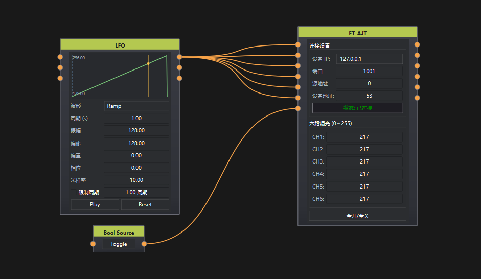

# FT-AJT

## 1. 节点说明

**FT-AJT** 作为 TCP Client 连接灯光控制器（设备为 TCP Server，默认端口 **1001**），按厂家调光协议发送六路亮度。

## 2. 协议

```text
F7 | LEN(0B) | SRC | DST | 02 | 13 | CH1..CH6 | CSUM | FD
```

- 单通道调节：目标通道写亮度，其余填 `01`（不控制）
- 数值原样发送（0～255）
- 发送 **2ms 防抖**；界面显示约 **16ms** 合并刷新
- 输出端口立即同步软件当前通道值

## 3. 全开 / 全关

- **按下（全开）**：立即发送当前六路值，之后通道变化会下发
- **弹起（全关）**：强制下发六路全 0（不改界面当前值），之后不下发；界面/输入/输出仍正常更新

## 4. 端口

| 端口 | 说明 |
|------|------|
| CH1～CH6 输入 | 写入亮度 0～255 |
| 全开/全关 输入 | true/非 0 → 全开；false/0/断开 → 全关 |
| CH1～CH6 输出 | 软件当前通道值（与界面同步） |

## 5. 界面

- 设备 IP / 端口（默认 `127.0.0.1:1001`）
- 源地址 / 设备地址（默认 `0x00` / `0x35`）
- 六路亮度、全开/全关（可勾选，默认全关）

外部控制：`/host`、`/port`、`/srcAddr`、`/dstAddr`、`/enable`、`/CH1`～`/CH6`

## 6. 示例

- 通过LFO输出曲线控制亮度变化