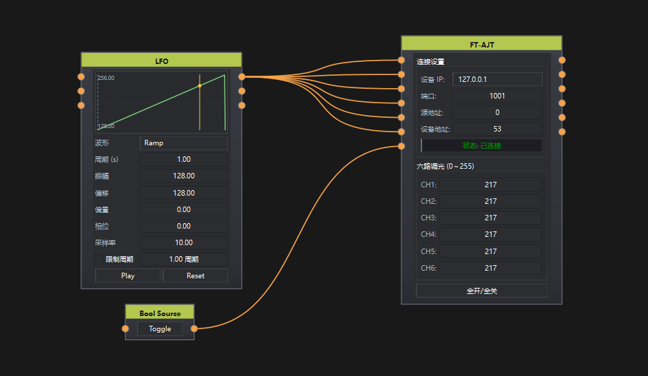
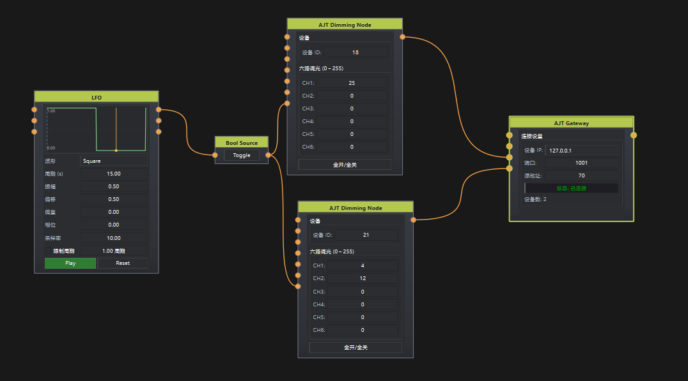
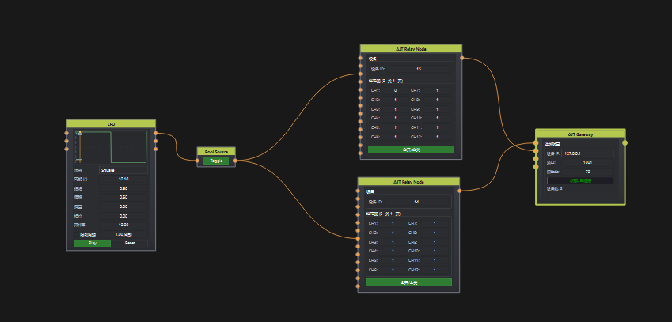
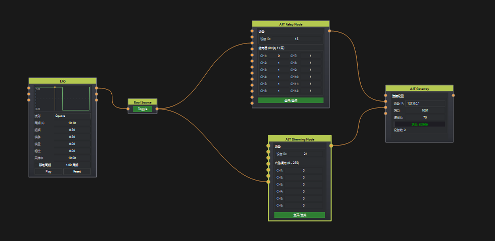

# AJT Node

## 1. 节点说明

**AJT Node**（注册别名 **AJT Dimming Node**）表示一台六路调光设备：维护设备 ID、六路亮度与全开/全关状态，经 `DATA` 口输出结构化数据，供 **AJT Gateway** 合并下发到灯光控制器。

本节点不直接建立 TCP；网络连接与组帧由 Gateway 负责。

## 2. 端口说明

### 输入

| 端口 | 类型 | 说明 |
|------|------|------|
| CH1～CH6 | VariableData | 单路亮度 0～255 |
| ALL ON/OFF | VariableData | `true`/非 0 → 全开；`false`/0/断开 → 全关 |

### 输出

| 端口 | 类型 | 说明 |
|------|------|------|
| DATA | VariableData | `default` 为 `{ kind:"dim", id, enable, channels[6] }` |

## 3. 界面说明

- **设备 ID**：控制器上的设备地址（默认 `0x15` / 21）。
- **六路调光**：CH1～CH6，范围 0～255。
- **全开/全关**：关闭时仍保留界面亮度；Gateway 下发该设备时强制六路为 0。

外部控制：`/id`、`/enable`、`/CH1`～`/CH6`。

## 4. 使用说明

1. 设置设备 ID，与现场编址一致。
2. 用滑块、CH 输入或 ALL ON/OFF 写入亮度与开关状态。
3. 将 DATA 接到 **AJT Gateway** 的 NODE 输入。
4. 多台调光设备时，每台一个本节点，ID 不要重复。

## 5. 示例

LFO 或 Range Map（0～255）→ CH1～CH6；ALL ON/OFF 接逻辑开关；DATA → AJT Gateway NODE 1。

---

# AJT Dimming Node

## 1. 节点说明

**AJT Dimming Node** 与 **AJT Node** 为同一调光模型（注册别名），功能、端口与界面完全一致。详见上一节 **AJT Node**。

表示一台六路调光设备：设备 ID + 六路亮度 + 全开/全关 → `DATA`（`kind=dim`）→ **AJT Gateway**。

## 2. 端口说明

### 输入

| 端口 | 类型 | 说明 |
|------|------|------|
| CH1～CH6 | VariableData | 单路亮度 0～255 |
| ALL ON/OFF | VariableData | `true`/非 0 → 全开；`false`/0/断开 → 全关 |

### 输出

| 端口 | 类型 | 说明 |
|------|------|------|
| DATA | VariableData | `default` 为 `{ kind:"dim", id, enable, channels[6] }` |

## 3. 界面说明

- **设备 ID**：默认 `0x15`。
- **六路调光 / 全开全关**：同 AJT Node。

外部控制：`/id`、`/enable`、`/CH1`～`/CH6`。

## 4. 使用说明

1. 设置设备 ID。
2. 写入各路亮度与全开/全关。
3. DATA → **AJT Gateway** NODE 口。

## 5. 示例

同 AJT Node：曲线源 → CH → DATA → Gateway。

---

# AJT Relay Node

## 1. 节点说明

**AJT Relay Node** 表示一台继电器（开关）模块：维护设备 ID、12 路开关状态与全开/全关，经 `DATA` 口输出（`kind=relay`），由 **AJT Gateway** 单独合并为继电器指令帧下发。

本节点不直接建立 TCP。

## 2. 端口说明

### 输入

| 端口 | 类型 | 说明 |
|------|------|------|
| CH1～CH12 | VariableData | `0` = 关，非 0 = 开 |
| ALL ON/OFF | VariableData | `true`/非 0 → 全开；`false`/0/断开 → 全关 |

### 输出

| 端口 | 类型 | 说明 |
|------|------|------|
| DATA | VariableData | `default` 为 `{ kind:"relay", id, enable, channels[12] }` |

## 3. 界面说明

- **设备 ID**：默认 `0x01`。
- **继电器 (0=关 1=开)**：CH1～CH12。
- **全开/全关**：关闭时 Gateway 对该设备 12 路均按「关」编码下发（不改界面勾选值的本地显示逻辑与调光节点一致：保留本地通道值，下发时按 enable 处理）。

外部控制：`/id`、`/enable`、`/CH1`～`/CH12`。

## 4. 使用说明

1. 设置设备 ID，与继电器模块地址一致。
2. 用界面或输入口设置各路开/关；需要整体关闭时用 ALL ON/OFF。
3. DATA → **AJT Gateway** NODE 口（可与调光节点共用同一 Gateway）。
4. 多台继电器时各用一个本节点，ID 勿冲突。

## 5. 示例

逻辑/条件节点 → CH1；按钮 → ALL ON/OFF；DATA → AJT Gateway NODE 2。

---

# AJT Gateway

## 1. 节点说明

**AJT Gateway** 作为 TCP Client 连接灯光/继电器控制器（设备为 TCP Server，默认端口 **1001**），接收多个 **AJT Node / AJT Dimming Node / AJT Relay Node** 的 `DATA`，按类型合并后下发。

- **调光**与**继电器**分帧组包，互不混在同一条指令里。
- 厂家约束：500ms 内多条指令可能丢包 → 同类型 **500ms 去重合并**；异类型 **分开发送且间隔 ≥500ms**。

## 2. 端口说明

### 输入

| 端口 | 类型 | 说明 |
|------|------|------|
| NODE 1～N | VariableData | 接收各设备 DATA（默认可编辑 4 路，可增删） |

### 输出

| 端口 | 类型 | 说明 |
|------|------|------|
| STATUS | VariableData | TCP 连接状态（布尔） |

## 3. 界面说明

- **设备 IP / 端口**：默认 `127.0.0.1:1001`。
- **源地址**：帧头 SRC（默认 `0x46`）；帧头 DST 固定为 `0x00`（界面不提供目的地址）。
- **连接状态 / 设备数**：当前 TCP 是否就绪、已缓存的设备条数。

外部控制：`/host`、`/port`、`/srcAddr`。

## 4. 协议说明

### 调光合并帧（TYPE=`F2`）

```text
F7 | LEN | SRC | DST(00) | F2 | 15 | (ID CH1..CH6)*N | CSUM | FD
```

- `LEN = body.size() + 1`
- `CSUM = (LEN + sum(body)) & 0xFF`
- 全关设备：六路亮度按 0 下发

### 继电器合并帧（TYPE=`F1`）

```text
F7 | LEN | SRC | DST(00) | F1 | 15 | (ID B0 B1 B2)*N | CSUM | FD
```

每设备 3 字节，每字节 4 路 × 2bit：

| 编码 | 含义 |
|------|------|
| `00` | 无效 |
| `01` | 开 |
| `10` | 关 |

字节内顺序为通道 **4.3.2.1**（高位对→低位对）。`B0`=CH1～4，`B1`=CH5～8，`B2`=CH9～12。

Gateway 连续同步时对已接入通道下发明确开/关（不用 `00`）；全关时该设备 12 路均为关（`10`）。

单设备开关码举例（非合并帧，厂家原始格式；ID=1，仅 CH1 开）：

```text
F7 08 00 01 01 13 01 00 00 1E FD
```

### 下发节奏

| 规则 | 说明 |
|------|------|
| 同类型去重 | 调光或继电器各自独立：500ms 窗口内多次变化合并为一条再发 |
| 异类型错开 | 两类都有变化时分开发，任意两帧间隔 ≥500ms |
| 按变化类型 | 仅调光变 → 只发 F2；仅继电器变 → 只发 F1 |

## 5. 使用说明

1. 填写控制器 IP、端口、源地址，确认 STATUS 为已连接。
2. 将各 AJT Dimming / Relay 的 DATA 接到 NODE 1、NODE 2…
3. 调光与继电器可混接同一 Gateway；内部会按 `kind` 分帧，并遵守 500ms 间隔。
4. 需要更多设备时，在节点上增加输入口数量。

## 6. 示例


两台调光 + 一台继电器：

```text
[AJT Dimming] --DATA--> NODE 1 \
[AJT Dimming] --DATA--> NODE 2  → [AJT Gateway] --TCP--> 控制器
[AJT Relay]   --DATA--> NODE 3 /
```

调光变化后约 500ms 发一帧 `F2`；若同时有继电器变化，则再隔 ≥500ms 发一帧 `F1`。
