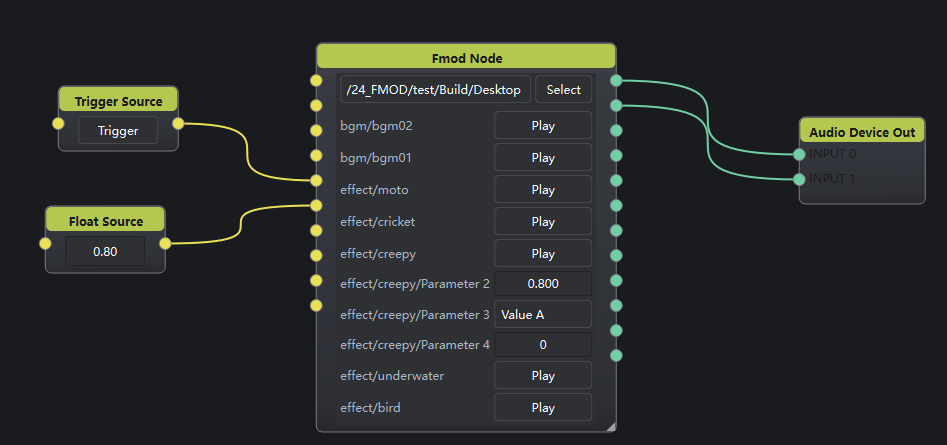

# Fmod Node

## 1. 节点说明

加载 FMOD Studio 导出的 **Bank 目录**，枚举其中事件并播放，最多 **12** 路音频输出。支持多事件叠播、同事件多层叠发（实例上限与偷换由 FMOD Studio 的 Max Instances / Stealing 决定）。适合游戏音效、互动装置等场景。

Core 使用 `NOSOUND`，经 DSP 捕获后走节点图输出；可用 FMOD Studio **Live Update** 连到本进程实时调参。

## 2. 端口说明

### 输入（随 Bank 动态变化）

加载 Bank 后按事件重建输入口，**每个事件 1 个触发口**；若该事件含用户参数，再紧跟 **每个参数 1 个数值口**。

| 口类型 | 端口类型 | 说明 |
|--------|----------|------|
| 触发（如 `effect/creepy`） | VariableData | `true` 时播放该事件；连线瞬间的 `false` 不触发 |
| 参数（如 `effect/creepy/Parameter 2`） | VariableData | 写入浮点/整型，同步到面板并作用于存活实例 |

仅暴露 **Game Controlled** 用户参数（Continuous / Discrete / Labeled）；内置自动参数（Distance 等）不建口。

### 输出

- **Out 1**～**Out 12**（AudioData）：捕获的多声道输出（RAW 12 声道布局）。

## 3. 界面说明

| 控件 | 说明 |
|------|------|
| Bank 路径 + Select | 选择含 `.bank` 的文件夹（需含 `strings.bank`） |
| 事件行 | `事件短名` + **Play**（与触发口对应） |
| 参数行 | `事件/参数名` + FloatDrag / IntDrag / 下拉（与参数口对应） |

面板改参会立即更新正在播放的实例，并在下次播放时沿用。

本节点**不**注册 OSC 外部控制与状态反馈；播放与改参仅通过面板与输入口。

## 4. 使用说明

1. 在 FMOD Studio Build 出 Desktop Bank，保证目录内有 `*.bank` 与 `strings.bank`。
2. 节点内填写或 Select Bank 文件夹；等待事件/参数列表与输入口生成。
3. 用 **Play** 或触发口（`true`）播放；用参数控件或参数口调参。
4. 将 **Out n** 接到混音、分析或声卡节点。
5. （可选）Studio 开启 Live Update 连接本程序，边播边调听感；结构变更后仍需重新 Build 并加载 Bank。

## 5. 示例

- Bool / Trigger → `effect/creepy` 触发口；Float → `effect/creepy/Parameter 2` → Fmod Node → AnSpec / 声卡
- 先播 `bgm/bgm01`，再触发 `effect/...`，可同时出声（多 Instance）
