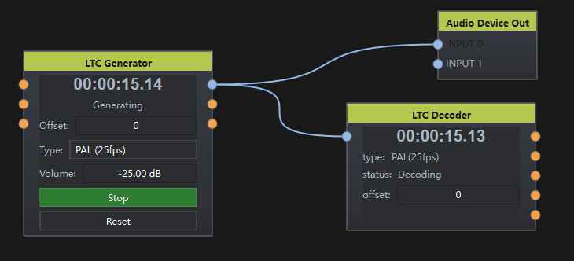

# LTC Generator

## 1. 节点说明

生成 LTC 时间码音频信号并输出，用于同步外部录像机、灯光台等设备。可在界面或端口控制启停、音量与归零，并对外反馈启停与音量状态。

## 2. 端口说明

### 输入

- **START**（VariableData）：true 启动，false 停止。
- **VOLUME**（VariableData）：音量（dB）。
- **RESET**（VariableData）：为 true 时时间码归零。

### 输出

- **AUDIO**（AudioData）：LTC 音频波形（48 kHz）。
- **START**（VariableData）：当前是否正在生成。
- **VOLUME**（VariableData）：当前音量（dB）。

### 外部控制 / 状态反馈（OSC / WebSocket）

- `/start`：读写启停（bool）
- `/volume`：读写音量（dB）
- `/offset`：读写时间码偏移（帧）
- `/reset`：写 true 时归零（脉冲属性）

## 3. 界面说明

时间码显示、帧率/制式选择、音量、可勾选的启停按钮、复位按钮。

## 4. 使用说明

1. 在界面设置制式与音量，勾选「Start」开始生成（再次点击变为 Stop）。
2. 将 AUDIO 接到 Audio Device Out、VST 或录音链路。
3. 可用 START / VOLUME 端口远程控制，并从同名输出读取当前状态。

## 5. 示例

LTC Generator → Audio Device Out → 调音台 LTC 输入，驱动全场时间同步。
