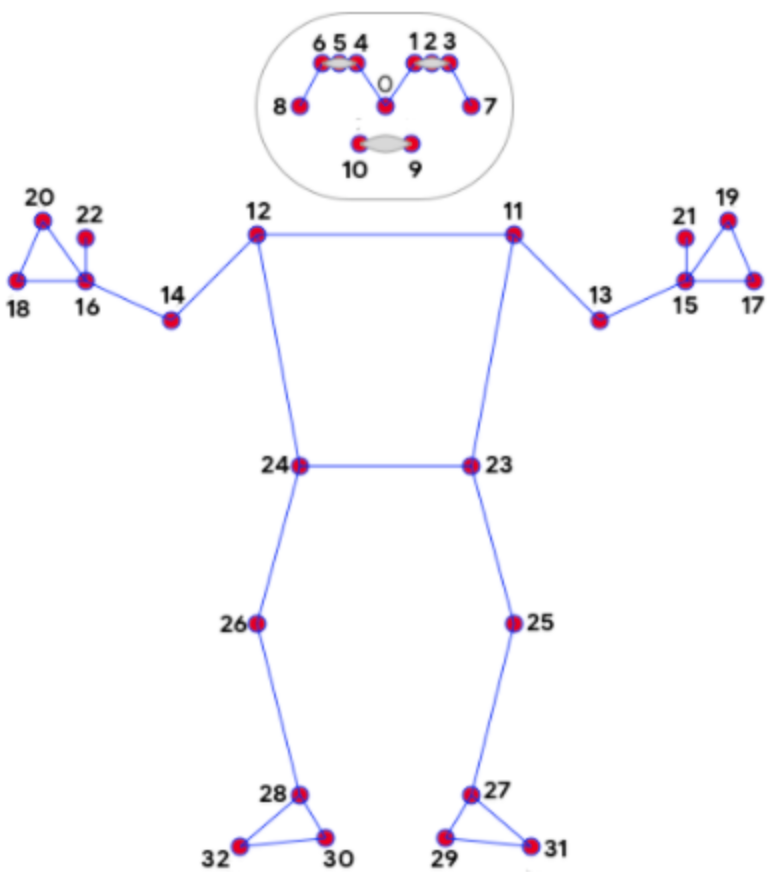

# MediaPipe Body Pose

## 1. 节点说明

基于 [OpenCV Zoo MediaPipe Pose](https://github.com/opencv/opencv_zoo/tree/main/models/pose_estimation_mediapipe) 实现的人体关节点预测节点。采用两阶段推理：

1. **人体检测**（`person_detection_mediapipe_2023mar.onnx`）
2. **姿态估计**（`pose_estimation_mediapipe_2023mar.onnx`）

每个检测到的人体输出 **33 个 BlazePose 关键点**（屏幕坐标 + 3D 世界坐标）。

## 2. 端口说明

### 输入

- **IMAGE**（ImageData）：输入画面。
- **ENABLE**（VariableData）：启停检测。

### 输出

- **IMAGE 0**（ImageData）：带骨架标注的图像。
- **RESULT**（VariableData）：检测数据，结构见下文。

## 3. RESULT 数据结构

```json
{
  "count": 1,
  "width": 1920,
  "height": 1080,
  "detections": [
    {
      "confidence": 0.95,
      "bbox": { "x1": 100, "y1": 50, "x2": 500, "y2": 900 },
      "keypoints": [ ... ],
      "world_landmarks": [ ... ]
    }
  ]
}
```

- `count`：检测到的人数（经 NMS 后）。
- `detections[]`：每人一条记录。
- `bbox`：人体包围框（像素坐标，左上 / 右下）。
- `keypoints`：屏幕空间关键点，共 **33** 个，见第 5 节。
- `world_landmarks`：世界空间关键点，共 **33** 个，见第 6 节。

## 4. keypoints 与 world_landmarks 的区别

| | **keypoints**（屏幕关键点） | **world_landmarks**（世界关键点） |
|---|---|---|
| **坐标系** | 2D 图像像素坐标 + 相对深度 | 以髋部为原点的 3D 米制坐标 |
| **用途** | 在画面上叠加、点击检测、区域判断 | 3D 姿态分析、角度计算、跨视角比较 |
| **x, y** | 输入图像中的像素位置 | 左右 / 前后方向（米，以髋为中心） |
| **z** | 相对髋部的深度（无固定单位，用于前后关系） | 真实尺度深度（米） |
| **额外字段** | `visibility`、`presence` | 仅 `x, y, z` |
| **是否受透视影响** | 是（近大远小） | 否（已估计为 3D 骨架） |

**简要理解：**

- **`keypoints`**：点在**画面上的位置**，适合画骨架、做屏幕交互（例如「手是否进入某矩形」）。
- **`world_landmarks`**：点在**三维空间中的位置**（以双髋中点为原点），适合算关节角度、判断肢体朝向，不随镜头远近而「缩放」。

> 模型内部共输出 39 个点（33 个主关键点 + 6 个辅助点）。节点在 RESULT 中**仅输出前 33 个**主关键点，与 [MediaPipe BlazePose](https://github.com/tensorflow/tfjs-models/tree/master/pose-detection#blazepose-keypoints-used-in-mediapipe-blazepose) 索引一致。

### keypoints 字段说明

每个 `keypoints[i]` 包含：

| 字段 | 含义 |
|------|------|
| `x`, `y` | 关键点在输入图像中的像素坐标 |
| `z` | 相对髋部（HIP）的深度；**不是**米制绝对深度，仅表示前后相对关系 |
| `visibility` | 该点是否可见、未被遮挡的概率（0–1） |
| `presence` | 该点是否落在画面内的概率（0–1） |

绘制骨架时，通常以 `presence > 0.8` 过滤低置信度点（与 OpenCV Zoo demo 一致）。

### world_landmarks 字段说明

每个 `world_landmarks[i]` 包含：

| 字段 | 含义 |
|------|------|
| `x` | 左右方向，单位米（以髋部为原点） |
| `y` | 上下方向，单位米 |
| `z` | 前后方向，单位米 |

同一索引 `i` 在 `keypoints` 与 `world_landmarks` 中对应**同一个解剖学关节**，只是表达方式不同。

## 5. 33 个关键点索引



| 索引 | 名称 | 索引 | 名称 |
|------|------|------|------|
| 0 | 鼻子 (nose) | 17 | 左手小指 (left pinky) |
| 1 | 左眼内角 (left eye inner) | 18 | 右手小指 (right pinky) |
| 2 | 左眼 (left eye) | 19 | 左手食指 (left index) |
| 3 | 左眼外角 (left eye outer) | 20 | 右手食指 (right index) |
| 4 | 右眼内角 (right eye inner) | 21 | 左手拇指 (left thumb) |
| 5 | 右眼 (right eye) | 22 | 右手拇指 (right thumb) |
| 6 | 右眼外角 (right eye outer) | 23 | 左髋 (left hip) |
| 7 | 左耳 (left ear) | 24 | 右髋 (right hip) |
| 8 | 右耳 (right ear) | 25 | 左膝 (left knee) |
| 9 | 嘴左 (mouth left) | 26 | 右膝 (right knee) |
| 10 | 嘴右 (mouth right) | 27 | 左踝 (left ankle) |
| 11 | 左肩 (left shoulder) | 28 | 右踝 (right ankle) |
| 12 | 右肩 (right shoulder) | 29 | 左脚跟 (left heel) |
| 13 | 左肘 (left elbow) | 30 | 右脚跟 (right heel) |
| 14 | 右肘 (right elbow) | 31 | 左脚尖 (left foot index) |
| 15 | 左腕 (left wrist) | 32 | 右脚尖 (right foot index) |
| 16 | 右腕 (right wrist) | | |

**常用索引示例：**

- 左/右手腕：15 / 16
- 左/右肩：11 / 12
- 左/右髋：23 / 24（`world_landmarks` 坐标原点参考）
- 左/右膝：25 / 26

## 6. 界面说明

- 人体检测阈值、NMS 阈值、姿态置信度
- 最大帧率（1–30 FPS）
- **使用 GPU (OpenCV CUDA DNN)**：默认开启；需 OpenCV 编译时启用 CUDA/cuDNN，否则自动回退 CPU
- 绘制骨架（关闭后仅输出 RESULT，可降低 CPU 占用）
- 启停按钮

## 7. 模型文件

将以下 ONNX 模型放入 `./plugins/Models/`：

- `person_detection_mediapipe_2023mar.onnx`
- `pose_estimation_mediapipe_2023mar.onnx`

下载地址：[person_detection_mediapipe](https://github.com/opencv/opencv_zoo/tree/main/models/person_detection_mediapipe)、[pose_estimation_mediapipe](https://github.com/opencv/opencv_zoo/tree/main/models/pose_estimation_mediapipe)

## 8. 使用说明

1. 连接视频或图像到 IMAGE，并通过 ENABLE 或面板启用检测。
2. 用 **IMAGE 0** 预览骨架；用 **RESULT** 驱动后续逻辑。
3. 屏幕交互、热区判断 → 读 `keypoints`；角度 / 3D 姿态 → 读 `world_landmarks`。
4. 支持 OSC：`/personScore`、`/nms`、`/confidence`、`/enable`。

## 9. 示例

Camera → MediaPipe Body Pose → Spout Out，互动装置人体骨骼可视化。
