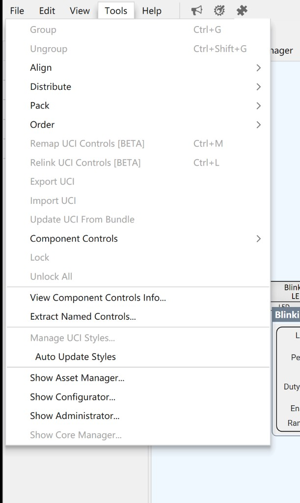

# Q-SYS ECP

## 1. 节点说明

通过 **ECP**（TCP **:1702**，写死）控制 Q-SYS Named Controls。

工作流：

1. Designer：拖控件到 Named Controls → **Tools → Extract Named Controls…** 导出 XML  
2. 把 XML 放进媒体库（Document）  
3. 本节点用 **SelectorComboBox** 选择该文件 → **自动列出全部 Named Control，并同步 In/Out 端口数**  
4. 勾选「连接」连上 Core，读写端口  

文档：[ECP](https://help.qsys.com/q-sys_9.5/Content/External_Control_APIs/ECP/ECP_Overview.htm) · [Named Controls](https://help.qsys.com/q-sys_9.5/Content/Schematic_Library/external_control.htm)

## 2. 端口

`PortEditable = false`。端口数量 = XML 中 Named Control 数量（加载/更换 XML 时自动增删）。

| 方向 | caption | 行为 |
|------|---------|------|
| 输入 `[i] Id` | 写第 i 个控件 | `csv` / `css` / `ct` |
| 输出 `[i] Id` | 当前值 | Change Group `cgs` → `cv` |

## 3. 界面

| 控件 | 说明 |
|------|------|
| 主机 | Core IP |
| 用户 / PIN | 可选登录 |
| Named Controls XML | 媒体库 Document 选择器 |
| 连接指示 | 只读状态显示 + OSC `/connected`（节点自动连接） |
| 列表 | 全部 Named Control + 实时值 |

## 4. 从 Q-SYS Designer 导出 XML

在 Q-SYS Designer 中选择 **Tools → Extract Named Controls…** 可导出外部控制描述的 XML 文件：

