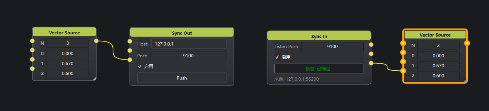

**SyncNode 插件文档**

本插件（`Network` 分类）包含两个节点：**Sync Out** 与 **Sync In**。用于在不同主机 / 进程之间同步多路 `VariableData`。

传输为 **TCP**（行分隔 JSON）。

**角色（支持一对多）：**

| 节点 | 角色 | 说明 |
|------|------|------|
| Sync Out | **TCP 服务端** | 在 Listen Port 上监听，向**所有**已连接的 In 广播 |
| Sync In | **TCP 客户端** | 连到 `Host:Port`；多个 In 可连同一 Out |

**心跳：** Out 每 2s 广播 `{"t":"hb"}`，In 回同样心跳；任一侧 6s 无任何包（含数据/心跳）则判定掉线并清理/重连。同时开启 TCP KeepAlive。

---

# Sync Out

## 1. 节点说明

发送端 / 发布端。监听端口，接受多个 Sync In 连接并广播口数与数值。新客户端连上时会自动 Push 当前缓存。

## 2. 界面

| 控件 | 含义 | 默认 |
|------|------|------|
| Listen Port | 本机监听端口 | `9100` |
| 启用 | 关闭后停止监听 | 开 |
| 状态 | 未监听 / 等待连接 / 已连接 (N) | — |
| Push | 向全部客户端重发 | — |

外部地址：`/port`、`/active`、`/connected`、`/push`。

## 3. 用法

1. 设 Listen Port 并启用 → 「等待连接」。
2. 一个或多个 Sync In 填同一 Port（Host 填本机或 Out 所在机 IP）。
3. Out 显示「已连接 (N)」即可。

---

# Sync In

## 1. 节点说明

接收端 / 订阅端。作为客户端连接 Out；断线约每秒重连。

## 2. 界面

| 控件 | 含义 | 默认 |
|------|------|------|
| Host | Out 所在主机 | `127.0.0.1` |
| Port | Out 的 Listen Port | `9100` |
| 启用 | 关闭后断开 | 开 |
| 状态 | 已连接 / 未连接 | — |
| 对端 | 当前目标 `Host:Port` | — |

外部地址：`/host`、`/port`、`/active`、`/connected`、`/lastSource`。

## 3. 用法

多个 In 使用相同 Host+Port → 一对多。不同业务用不同端口隔离。

---

## 协议

一行一条 Compact JSON（`\n` 结尾）：

```json
{"n":4}
{"n":4,"i":0,"v":123}
{"t":"hb"}
```

默认端口：`9100`。心跳间隔 2s，超时 6s。

---

## 示例

**一对多：** 一个 Sync Out（Listen `9101`）+ 两个 Sync In（都连 `127.0.0.1:9101`），两边都应「已连接」，Out 显示 `已连接 (2)`。


