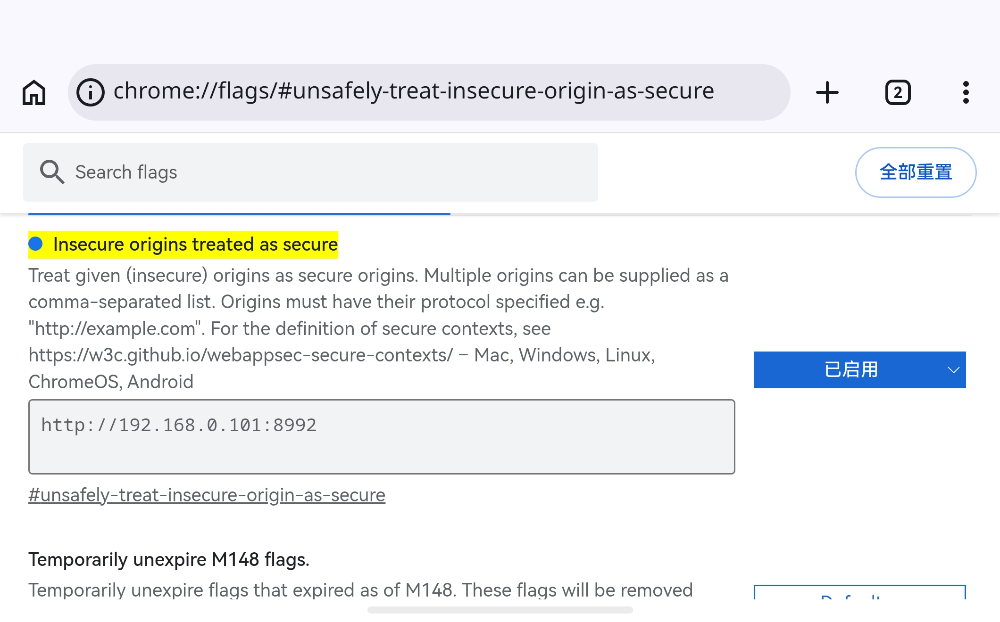

# Web Mic

## 1. 节点说明

独立 WebSocket 服务，接收网页 / 第三方客户端推送的实时 PCM，输出单声道 AudioData。固定格式：**mono / 48 kHz / float32 LE**。适合呼叫站、网页对讲，可接到 Audio Priority 的 Priority 口。

## 2. 端口说明

### 输入

无。

### 输出

- **Mic**（AudioData）：单声道 PCM。
- **TALKING**（Variable / bool）：是否有客户端正在对讲。`true` = 已连接并推流（或保持连接），`false` = 空闲。可接到逻辑 / 闪避 / 指示灯等节点。

## 3. 参数

- **Port**（1–65535，默认 9101）：WebSocket 监听端口。
- **Gain**（-60 ~ 24 dB）：接收后增益。
- **Status**：Listening / Talking（面板显示）。

## 4. 外部地址

- `/port`：端口号（读写）
- `/gain`：增益 dB（读写）

对讲状态请使用输出端口 **TALKING**，不再提供 `/talking` OSC 反馈。

## 5. 协议（第三方接入）

Web Mic 只认 **独立 WebSocket 端口**（不是 Flow 控制台的 8992）。任意能发 binary WebSocket 的客户端均可接入。

### 5.1 连接

```
ws://<Flow主机IP>:<Port>
```

例：`ws://192.168.1.10:9101`（Port 以节点面板为准）。

### 5.2 音频格式（强制）

| 项 | 值 |
|---|---|
| 声道 | **mono（1）** |
| 采样率 | **48000 Hz** |
| 样点格式 | **IEEE float32，小端（LE）** |
| 传输 | WebSocket **binary** 帧 |
| 载荷 | 连续 float32 样点（无额外 header） |

- 每 4 字节 = 1 个样点，取值建议在 `[-1.0, 1.0]`。
- 可按任意块长发送（如 256 / 512 / 1024 / AudioWorklet 默认块）；节点会按全局时间戳帧长攒帧再写入音频图。
- **不要**发 JSON / 文本 PCM；文本帧会被当成数据但无法按 float 解析时会被丢弃。

### 5.3 会话语义

1. **连接成功** → 节点认为开始对讲，`TALKING = true`。
2. **持续发送** binary float32 PCM。
3. **断开连接** → 停止对讲，`TALKING = false`，清空未满一帧的残留缓冲。
4. 同一端口**以后连客户端为准**：新连接会接管，只处理当前活跃连接的 PCM。

无需握手包、无需鉴权（局域网场景）。若需安全接入，请在外层加 TLS / 反代，并改用 `wss://`（需服务端支持）。

### 5.4 浏览器示例（最小）

```js
const ws = new WebSocket(`ws://${location.hostname}:9101`);
ws.binaryType = "arraybuffer";

const ctx = new AudioContext({ sampleRate: 48000 });
const stream = await navigator.mediaDevices.getUserMedia({ audio: true });
const source = ctx.createMediaStreamSource(stream);
// 用 AudioWorklet / ScriptProcessor 取 mono float32，然后：
// ws.send(float32Array.buffer);

// 松开说话：
ws.close();
stream.getTracks().forEach(t => t.stop());
```

### 5.5 原生 / 其它语言注意点

- 确保主机字节序为小端，或发送前转为 LE float32。
- 若采集不是 48 kHz，请在客户端重采样到 48 kHz 再发送。
- 立体声请先下混为单声道再发送。
- 防火墙需放行节点 Port（默认 9101）。

### 5.6 与 Flow 网页 MIC 卡片的关系

WebInterface 的「对讲麦克风」卡片只是一个官方客户端：读取节点 `/port`，按住连接并推 PCM，松开断开。第三方可完全绕过网页，直接连同一 Port。

## 6. 使用说明

1. 放置 Web Mic，确认 Port。
2. （可选）WebInterface MIC 卡片 `entity` 绑到该节点 `/port`。
3. 按住说话 / 第三方推流；松开或断线停止。
4. **Mic** → Audio Priority（Priority）或 Audio Device Out。
5. **TALKING** → 需要联动的逻辑 / 指示 / 闪避触发等。

## 7. 浏览器麦克风与 HTTP（Chrome）

`getUserMedia`（麦克风）要求 **Secure Context**：默认只在 `https://` 或 `http://localhost` / `http://127.0.0.1` 下可用。用手机通过 `http://局域网IP:端口` 打开 Flow 网页时，Chrome 会拒绝麦克风。

### 方案：把该源标记为「受信任的不安全源」（开发 / 内网用）

1. 手机 Chrome 地址栏打开：`chrome://flags/#unsafely-treat-insecure-origin-as-secure`
2. 将 **Insecure origins treated as secure** 设为 **Enabled**。
3. 在下方输入框填入完整源（含协议与端口），例如：
   - `http://192.168.1.10:8990`
   - 多个源用英文逗号分隔。
4. 点页面底部 **Relaunch** 重启 Chrome。
5. 再用同一地址打开 Flow 网页，按住 MIC 卡片应能申请麦克风权限。

注意：

- 源必须与地址栏一致（协议、主机、端口都要对）。
- 这是 Chrome 本地开关，换设备 / 清数据后需重设；不适合对公网用户推广。
- 正式部署建议改用 **HTTPS**（或本机 `localhost` 访问），再通过 `wss://` / 安全页面对讲。
